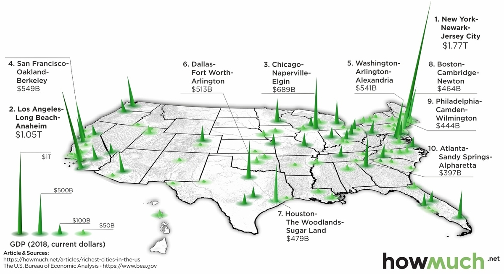

# 2020/W40: The U.S. Counties With the Highest Economic Output

**Data (data.world):** [https://data.world/makeovermonday/2020w40-the-us-cities-with-the-highest-economic-output](https://data.world/makeovermonday/2020w40-the-us-cities-with-the-highest-economic-output)

**Article / original viz:** [https://www.visualcapitalist.com/3d-map-the-u-s-cities-with-the-highest-economic-output/](https://www.visualcapitalist.com/3d-map-the-u-s-cities-with-the-highest-economic-output/)

**Dataset:** `makeovermonday/2020w40-the-us-cities-with-the-highest-economic-output`  
**Last updated on data.world:** 2020-10-05T07:25:54.045Z

---

The U.S. Counties With the Highest Economic Output

---
{"editor":"simple"}
---
# **Original Visualization**

# **About this Dataset**
SOURCE ARTICLE: [3D Map: The U.S. Cities With the Highest Economic Output](https://www.visualcapitalist.com/3d-map-the-u-s-cities-with-the-highest-economic-output/)
DATA SOURCE: [BEA.gov](https://www.bea.gov/data/gdp/gdp-county-metro-and-other-areas)

# **#MakeoverMonday Live TC20 Session Links**
MORNING SESSION (5th October 2020 at 08:00 GMT): [https://www.youtube.com/watch?v=dR5mpiHs-sU](https://www.youtube.com/watch?v=dR5mpiHs-sU)

AFTERNOON SESSION (5th October 2020 at 17:00 GMT): [https://www.youtube.com/watch?v=LPUksl37H70](https://www.youtube.com/watch?v=LPUksl37H70)

# **Objectives**
\* What works and what doesn't work with this chart?
\* How can you make it better?