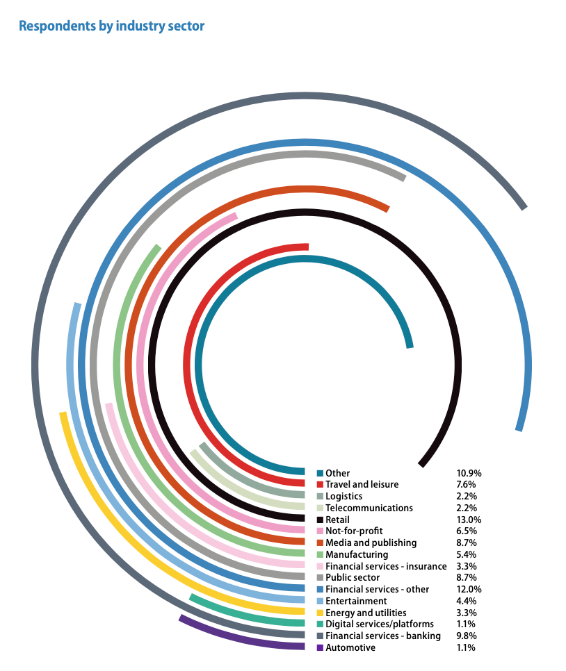

# 2020/W41: Data assets and data culture

**Data (data.world):** [https://data.world/makeovermonday/2020w41-data-assets-and-data-culture](https://data.world/makeovermonday/2020w41-data-assets-and-data-culture)

**Article / original viz:** [https://www.dataiq.co.uk/market-insight/data-assets-and-data-culture](https://www.dataiq.co.uk/market-insight/data-assets-and-data-culture)

**Dataset:** `makeovermonday/2020w41-data-assets-and-data-culture`  
**Last updated on data.world:** 2020-10-11T07:22:22.535Z

---

---
{"editor":"simple"}
---
# **Original Visualization**

# **About this Dataset**
SOURCE ARTICLE: [DataIQ - Market Insight - Data assets and data culture](https://www.dataiq.co.uk/market-insight/data-assets-and-data-culture)
DATA SOURCE: [Data manually lifted from PDF linked in source article](https://www.dataiq.co.uk/market-insight/data-assets-and-data-culture)

# **Objectives**

* What works and what doesn't work with this chart?
* How can you make it better?
* Due to rounding errors the total % of respondents exceeds 100% - do not stress about this!