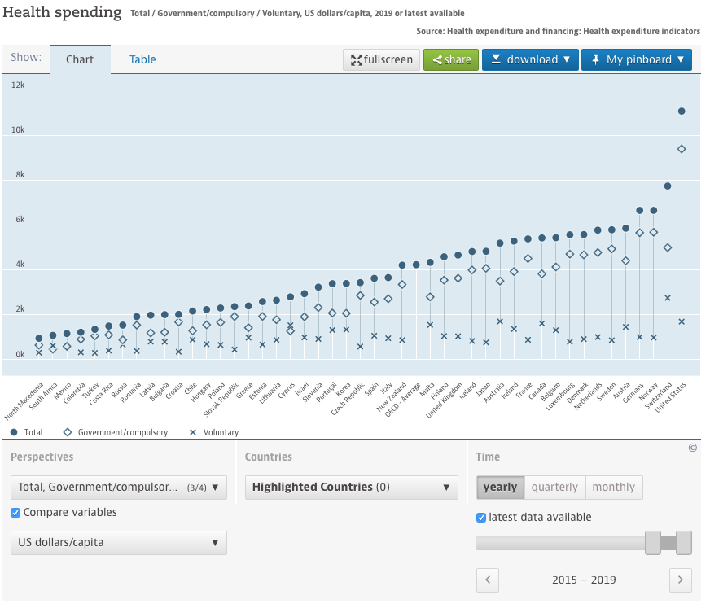

# 2020/W42: Health spending

**Data (data.world):** [https://data.world/makeovermonday/2020w42](https://data.world/makeovermonday/2020w42)

**Article / original viz:** [https://data.oecd.org/healthres/health-spending.htm](https://data.oecd.org/healthres/health-spending.htm)

**Dataset:** `makeovermonday/2020w42`  
**Last updated on data.world:** 2020-10-18T13:54:37.750Z

---

---
{"editor":"markdown"}
---
# **Original Visualization**

# **About this Dataset**
SOURCE ARTICLE: [Health spending](https://data.oecd.org/healthres/health-spending.htm)
DATA SOURCE: [OECD Data](https://stats.oecd.org/sdmx-json/data/DP_LIVE/.HEALTHEXP.../OECD?contentType=csv&detail=code&separator=comma&csv-lang=en)

# **Objectives**

* What works and what doesn't work with this chart? 
* How can you make it better?