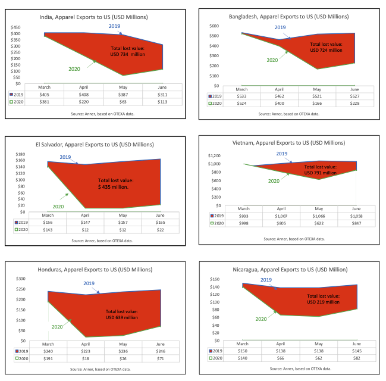

# 2020/W43: Apparel Exports to US

**Data (data.world):** [https://data.world/makeovermonday/2020w43-apparel-exports-to-us](https://data.world/makeovermonday/2020w43-apparel-exports-to-us)

**Article / original viz:** [https://www.workersrights.org/wp-content/uploads/2020/10/Unpaid-Billions_October-6-2020.pdf](https://www.workersrights.org/wp-content/uploads/2020/10/Unpaid-Billions_October-6-2020.pdf)

**Dataset:** `makeovermonday/2020w43-apparel-exports-to-us`  
**Last updated on data.world:** 2020-10-25T10:52:52.165Z

---

Apparel Exports to US

---
{"editor":"markdown"}
---
# **Original Visualization**

# **About this Dataset**
SOURCE ARTICLE: [workersrights.org](https://www.workersrights.org/wp-content/uploads/2020/10/Unpaid-Billions_October-6-2020.pdf)
DATA SOURCE: [Data manually lifted from source article. Original source is Otexa](https://otexa.trade.gov/msrpoint.htm)

# **Objectives**
\* What works and what doesn't work with this chart?
\* How can you make it better?