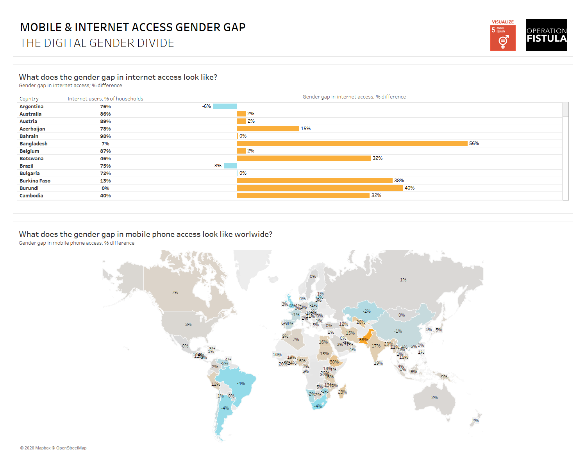

# 2020/W44: #Viz5 - The digital gender gap

**Data (data.world):** [https://data.world/makeovermonday/2020w44](https://data.world/makeovermonday/2020w44)

**Article / original viz:** [https://theinclusiveinternet.eiu.com/explore/countries/performance?category=overall](https://theinclusiveinternet.eiu.com/explore/countries/performance?category=overall)

**Dataset:** `makeovermonday/2020w44`  
**Last updated on data.world:** 2020-11-01T07:56:48.379Z

---

THE DIGITAL GENDER GAP

---
{"editor":"markdown"}
---
# **Original Visualization**

# **About this Dataset**
SOURCE ARTICLE: provided by OpFistula (see documentation below)
DATA SOURCE: [The Economist Intelligence Unit Inclusive Internet Index 2020](https://theinclusiveinternet.eiu.com/explore/countries/performance?category=overall)

# **Objectives**

* What works and what doesn't work with this chart?
* How can you make it better?