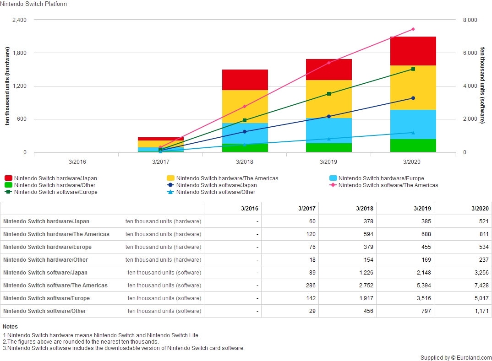

# 2020/W45: Dedicated Video Game Sales Units

**Data (data.world):** [https://data.world/makeovermonday/2020w45-dedicated-video-game-sales-units](https://data.world/makeovermonday/2020w45-dedicated-video-game-sales-units)

**Article / original viz:** [https://www.nintendo.co.jp/ir/en/finance/hard_soft/number.html](https://www.nintendo.co.jp/ir/en/finance/hard_soft/number.html)

**Dataset:** `makeovermonday/2020w45-dedicated-video-game-sales-units`  
**Last updated on data.world:** 2020-11-08T08:54:24.475Z

---

Dedicated Video Games Sales Units

---
{"editor":"markdown"}
---
# **Original Visualization**

# **About this Dataset**
SOURCE ARTICLE: [Nintendo Investor Relations](https://www.nintendo.co.jp/ir/en/finance/hard_soft/number.html)
DATA SOURCE: [Data downloaded from source article. Original source is Euroland.com](https://www.euroland.com)

# **Objectives**
\\\* What works and what doesn't work with this chart?
\\\* How can you make it better?