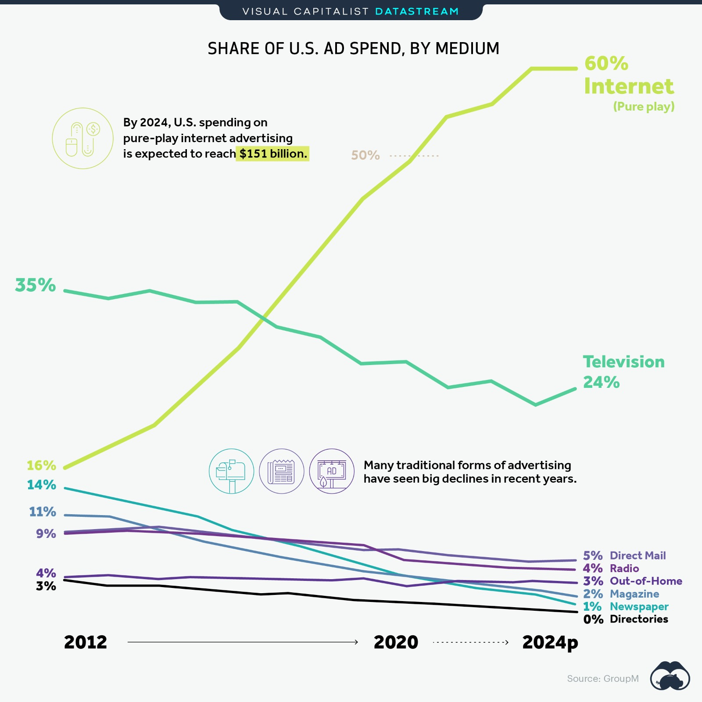

# 2020/W46: Majority of Advertising Dollars Now Spent Online

**Data (data.world):** [https://data.world/makeovermonday/2020w46](https://data.world/makeovermonday/2020w46)

**Article / original viz:** [https://www.visualcapitalist.com/majority-advertising-dollars-spent-online/](https://www.visualcapitalist.com/majority-advertising-dollars-spent-online/)

**Dataset:** `makeovermonday/2020w46`  
**Last updated on data.world:** 2020-11-15T12:13:19.730Z

---

---
{"editor":"markdown"}
---
# **Original Visualization**

# **About this Dataset**
SOURCE ARTICLE: [The Majority of Advertising Dollars are Now Being Spent Online](https://www.visualcapitalist.com/majority-advertising-dollars-spent-online/)
DATA SOURCE: [Group M](https://dmx9040v9xyo8.cloudfront.net/uploads/2020/06/groupmusadvertisingforecast-1.pdf)
Note: source article attached as PDF in this dataset

# **Objectives**

* What works and what doesn't work with this chart? 
* How can you make it better?