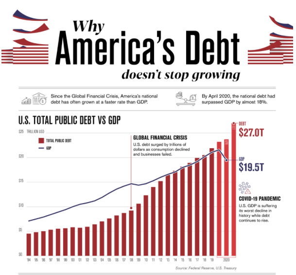

# 2020/W47: Why America's debt doesn't stop growing

**Data (data.world):** [https://data.world/makeovermonday/2020w47-why-americas-debt-doesnt-stop-growing](https://data.world/makeovermonday/2020w47-why-americas-debt-doesnt-stop-growing)

**Article / original viz:** [https://www.visualcapitalist.com/americas-debt-27-trillion-and-counting/](https://www.visualcapitalist.com/americas-debt-27-trillion-and-counting/)

**Dataset:** `makeovermonday/2020w47-why-americas-debt-doesnt-stop-growing`  
**Last updated on data.world:** 2020-11-22T09:04:38.774Z

---

Why America's debt doesn't stop growing

---
{"editor":"simple"}
---
# **Original Visualization**

# **About this Dataset**
SOURCE ARTICLE: [Visual Capitalist](https://www.visualcapitalist.com/americas-debt-27-trillion-and-counting/)
DATA SOURCES: [Federal Reserve Bank of St. Louis (GDP)](https://fred.stlouisfed.org/series/GDP) and [Federal Reserve Bank of St. Louis (Debt)](https://fred.stlouisfed.org/series/GFDEBTN)

# **Objectives**

* What works and what doesn't work with this chart?
* How can you make it better?