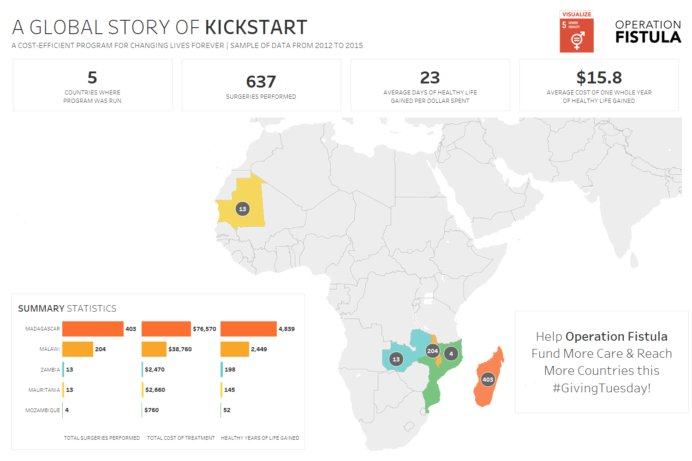

# 2020/W48: The success of Operation Fistula's Pilot Program

**Data (data.world):** [https://data.world/makeovermonday/2020w48](https://data.world/makeovermonday/2020w48)

**Article / original viz:** [https://data.world/makeovermonday/2020w48/file/Info%20Pack%20-%20Visualize%20Gender%20Equality%20Data%20Set%20%2310.pdf](https://data.world/makeovermonday/2020w48/file/Info%20Pack%20-%20Visualize%20Gender%20Equality%20Data%20Set%20%2310.pdf)

**Dataset:** `makeovermonday/2020w48`  
**Last updated on data.world:** 2020-11-29T08:35:22.717Z

---

The success of Operation Fistula's Pilot Program.

---
{"editor":"markdown"}
---
# **Original Visualization**

# **About this Dataset**
SOURCE ARTICLE: [Viz5 Info document](https://data.world/makeovermonday/2020w48/file/Info%20Pack%20-%20Visualize%20Gender%20Equality%20Data%20Set%20%2310.pdf)
DATA SOURCE: [Operation Fistula](https://data.world/makeovermonday/2020w48/file/20201027%20pilot%20data.csv)

# **Objectives**

* What works and what doesn't work with this chart? 
* How can you make it better?
PLEASE TAG [at]opfistula on Twitter and add the #Viz5 hashtag