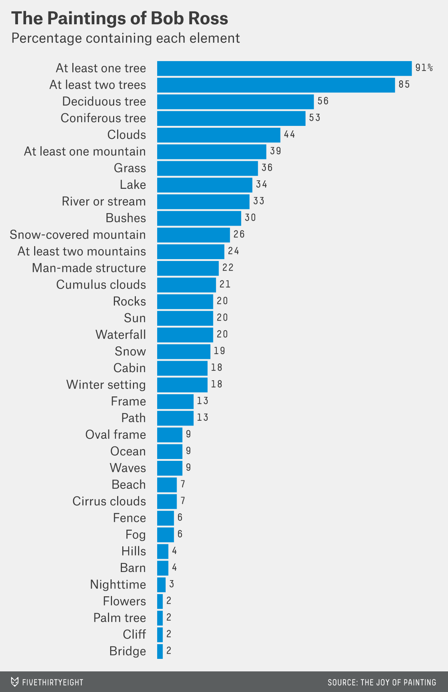

# 2020/W50: A Statistical Analysis of the Work of Bob Ross

**Data (data.world):** [https://data.world/makeovermonday/2020w50](https://data.world/makeovermonday/2020w50)

**Article / original viz:** [https://fivethirtyeight.com/features/a-statistical-analysis-of-the-work-of-bob-ross/](https://fivethirtyeight.com/features/a-statistical-analysis-of-the-work-of-bob-ross/)

**Dataset:** `makeovermonday/2020w50`  
**Last updated on data.world:** 2020-12-13T10:45:24.172Z

---

---
{"editor":"markdown"}
---
# **Original Visualization**

# **About this Dataset**
SOURCE ARTICLE: [A Statistical Analysis of the Work of Bob Ross](https://fivethirtyeight.com/features/a-statistical-analysis-of-the-work-of-bob-ross/)
DATA SOURCE: [GitHub](https://github.com/fivethirtyeight/data/blob/master/bob-ross/elements-by-episode.csv)

# **Objectives**

* What works and what doesn't work with this chart? 
* How can you make it better?