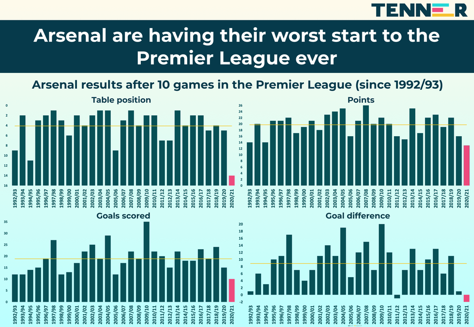

# 2020/W51: Arsenal's worst ever Premier League start

**Data (data.world):** [https://data.world/makeovermonday/2020w51-arsenals-worst-ever-premier-league-start](https://data.world/makeovermonday/2020w51-arsenals-worst-ever-premier-league-start)

**Article / original viz:** [https://www.reddit.com/r/soccer/comments/k5vya1/this_is_arsenals_worst_ever_start_to_a_premier/](https://www.reddit.com/r/soccer/comments/k5vya1/this_is_arsenals_worst_ever_start_to_a_premier/)

**Dataset:** `makeovermonday/2020w51-arsenals-worst-ever-premier-league-start`  
**Last updated on data.world:** 2020-12-20T09:55:29.659Z

---

Arsenal's worst ever Premier League start

---
{"editor":"markdown"}
---
# **Original Visualization**

# **About this Dataset**
SOURCE ARTICLE: [Original viz was created on Tenner App, but I can't find it so here's a Reddit link](https://www.reddit.com/r/soccer/comments/k5vya1/this_is_arsenals_worst_ever_start_to_a_premier/)
DATA SOURCES: [11v11.com](https://www.11v11.com/)

# **Objectives**
\* Data from 11v11.com is up to the 18th December each year from 1992/93 to 2020/21 so does not exactly mirror the original as it includes more games
\* What works and what doesn't work with this chart?
\* How can you make it better?