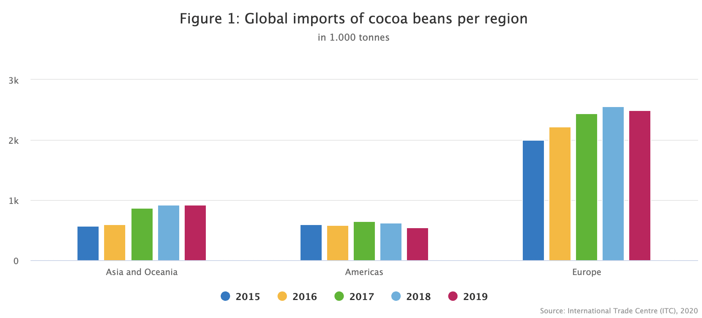

# 2020/W52: Global import of cocoa beans

**Data (data.world):** [https://data.world/makeovermonday/2020w52](https://data.world/makeovermonday/2020w52)

**Article / original viz:** [https://www.cbi.eu/market-information/cocoa/trade-statistics#](https://www.cbi.eu/market-information/cocoa/trade-statistics#)

**Dataset:** `makeovermonday/2020w52`  
**Last updated on data.world:** 2020-12-27T06:14:15.249Z

---

Global import of cocoa beans

---
{"editor":"markdown"}
---
# **Original Visualization**

# **About this Dataset**
SOURCE ARTICLE: [What is the demand for cocoa on the European market?](https://www.cbi.eu/market-information/cocoa/trade-statistics#)
DATA SOURCE: [CBI](https://www.cbi.eu/market-information/cocoa/trade-statistics#)

# **Objectives**

* What works and what doesn't work with this chart? 
* How can you make it better?