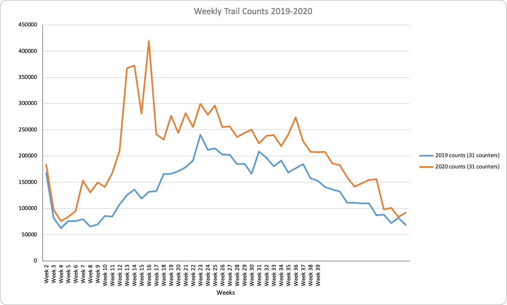

# 2021/W1: The Great Bicycle Boom of 2020

**Data (data.world):** [https://data.world/makeovermonday/2021w1](https://data.world/makeovermonday/2021w1)

**Article / original viz:** [https://www.bbc.com/future/bespoke/made-on-earth/the-great-bicycle-boom-of-2020.html](https://www.bbc.com/future/bespoke/made-on-earth/the-great-bicycle-boom-of-2020.html)

**Dataset:** `makeovermonday/2021w1`  
**Last updated on data.world:** 2021-01-03T14:01:14.318Z

---

The Great Bicycle Boom of 2020

---
{"editor":"simple"}
---
# **Original Visualization**

# **About this Dataset**
SOURCE ARTICLE: [BBC](https://www.bbc.com/future/bespoke/made-on-earth/the-great-bicycle-boom-of-2020.html)
DATA SOURCE: [Rails•to•Trail Conservancy](https://www.railstotrails.org/COVID19/#trailcount)
NOTE: Chart included in data source

# **Objectives**

* What works and what doesn't work with this chart?
* How can you make it better?