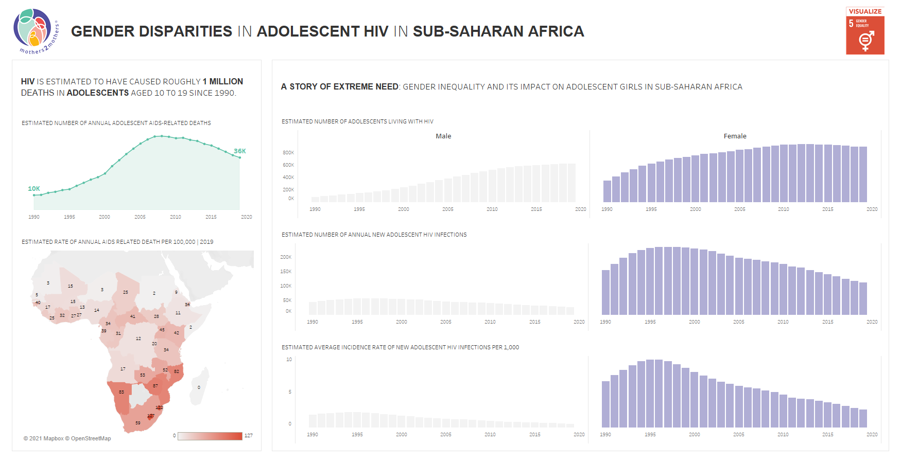

# 2021/W2: Gender Inequality in HIV Infections in Adolescents

**Data (data.world):** [https://data.world/makeovermonday/2021w2](https://data.world/makeovermonday/2021w2)

**Article / original viz:** [https://data.world/makeovermonday/2021w2](https://data.world/makeovermonday/2021w2)

**Dataset:** `makeovermonday/2021w2`  
**Last updated on data.world:** 2021-01-10T13:08:54.881Z

---

Viz5: Gender inequality in new HIV infections among adolescents

---
{"editor":"simple"}
---
# **Original Visualization**

# **About this Dataset**
DATA SOURCE: UNICEF