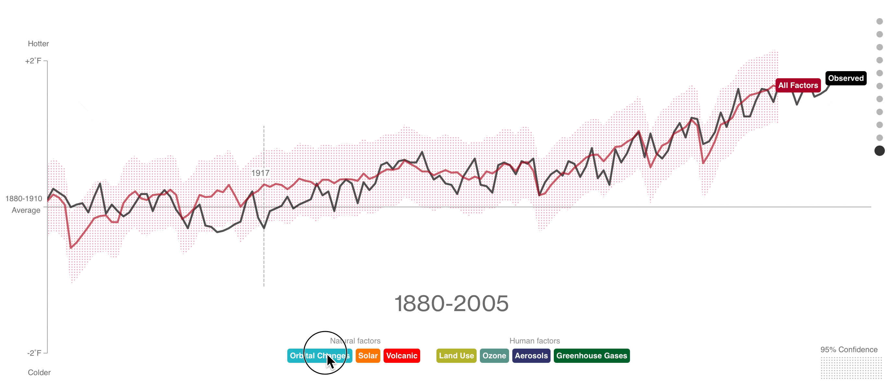

# 2021/W3: What's Warming The Earth?

**Data (data.world):** [https://data.world/makeovermonday/2021w3](https://data.world/makeovermonday/2021w3)

**Article / original viz:** [https://www.bloomberg.com/graphics/2015-whats-warming-the-world/](https://www.bloomberg.com/graphics/2015-whats-warming-the-world/)

**Dataset:** `makeovermonday/2021w3`  
**Last updated on data.world:** 2021-01-20T21:07:34.090Z

---

What's Warming The Earth?

---
{"editor":"markdown"}
---
# **Original Visualization**
​

​

# **About this Dataset**
SOURCE ARTICLE: [What's Really Warming the World?](https://www.bloomberg.com/graphics/2015-whats-warming-the-world/)
DATA SOURCE: [NASA Goddard Institute for Space Studies](https://data.giss.nasa.gov/gistemp/)
CREDITS:  [Eric Roston](https://twitter.com/eroston) ([@eroston](https://twitter.com/eroston)) and [Blacki Migliozzi](https://twitter.com/blackili) ([@blackili](https://twitter.com/blackili))

**NOTE: _The data represents deviations from the corresponding 1951-1980 means._**

​

# **Objectives**

* What works and what doesn't work with this chart?
* How can you make it better?