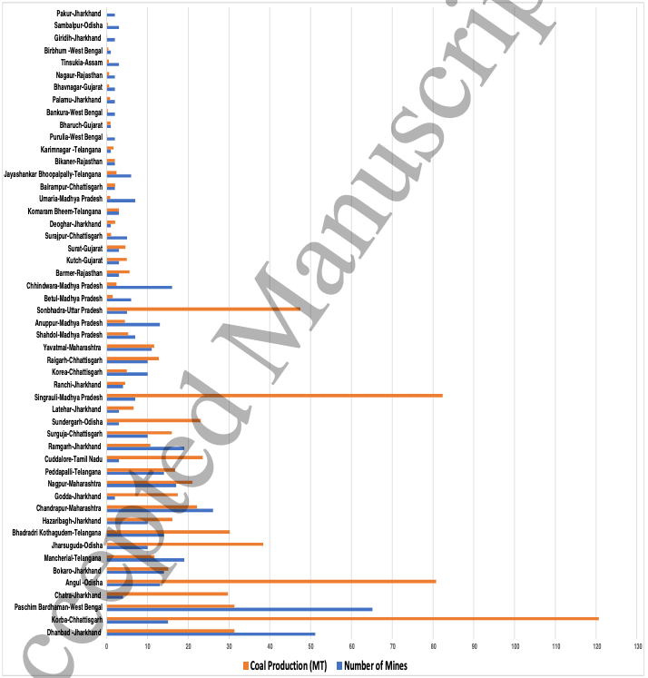

# 2021/W4: Indian Coal Mine Production

**Data (data.world):** [https://data.world/makeovermonday/2021w4](https://data.world/makeovermonday/2021w4)

**Article / original viz:** [https://iopscience.iop.org/article/10.1088/2633-1357/abdbbb/pdf](https://iopscience.iop.org/article/10.1088/2633-1357/abdbbb/pdf)

**Dataset:** `makeovermonday/2021w4`  
**Last updated on data.world:** 2021-01-24T13:08:38.316Z

---

Indian Coal Mine Locations & Production

---
{"editor":"simple"}
---
# **Original Visualization**

​

# **About this Dataset**
**Required Citation**
Sandeep Pai and Hisham Zerriffi. A novel dataset for analysing sub-national socioeconomic developments in the Indian coal industry, IOPSciNotes, [https://doi.org/10.1088/2633-1357/abdbbb](https://doi.org/10.1088/2633-1357/abdbbb)

SOURCE ARTICLE: [A novel dataset for analysing sub-national socioeconomic developments in the Indian coal industry](https://iopscience.iop.org/article/10.1088/2633-1357/abdbbb/pdf)
DATA SOURCE: Sandeep Pai and Hisham Zerriffi via [Harvard Dataverse](https://dataverse.harvard.edu/dataset.xhtml?persistentId=doi:10.7910/DVN/TDEK8O)

​

# **Objectives**

* What works and what doesn't work with this chart?
* How can you make it better?