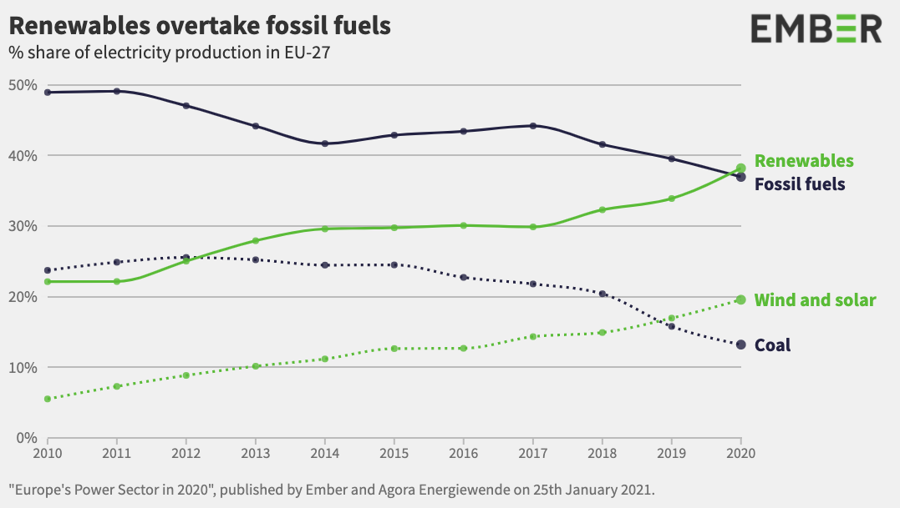

# 2021/W5: Renewables Overtake Fossil Fuels in Europe

**Data (data.world):** [https://data.world/makeovermonday/2021w5](https://data.world/makeovermonday/2021w5)

**Article / original viz:** [https://ember-climate.org/project/eu-power-sector-2020/](https://ember-climate.org/project/eu-power-sector-2020/)

**Dataset:** `makeovermonday/2021w5`  
**Last updated on data.world:** 2021-01-31T12:16:03.484Z

---

Renewables Overtake Fossil Fuels in Europe

---
{"editor":"simple"}
---
# **Original Visualization**

​

# **About this Dataset**
SOURCE ARTICLE: [Ember](https://ember-climate.org/project/eu-power-sector-2020/)
DATA SOURCE: [Ember](https://ember-climate.org/project/eu-power-sector-2020/)

​

# **Objectives**

* What works and what could be improved with this chart?
* How can you make it better?