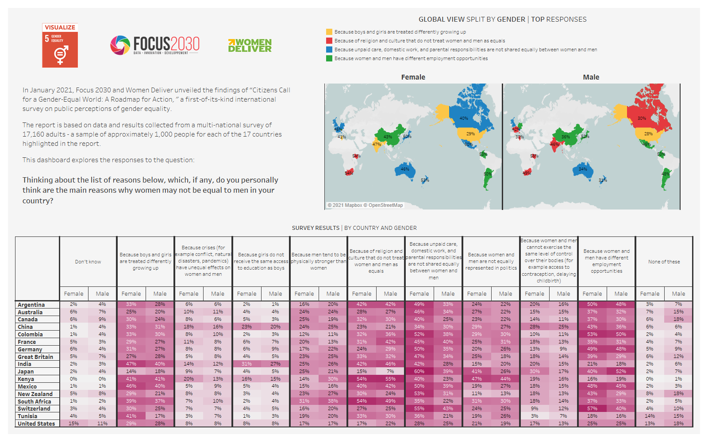

# 2021/W6: Perceived Obstacles to Gender Equality

**Data (data.world):** [https://data.world/makeovermonday/2021w6](https://data.world/makeovermonday/2021w6)

**Article / original viz:** [https://data.world/makeovermonday/2021w6](https://data.world/makeovermonday/2021w6)

**Dataset:** `makeovermonday/2021w6`  
**Last updated on data.world:** 2021-02-07T11:02:52.199Z

---

Perceived Obstacles to Gender Equality

---
{"editor":"simple"}
---
# **Original Visualization**

​

# **About this Dataset**
DATA SOURCE: [Focus 2030](https://focus2030.org/Explore-the-data-and-create-your-own-data-table)

​

# **Objectives**

1. What works?
2. What could be improved?