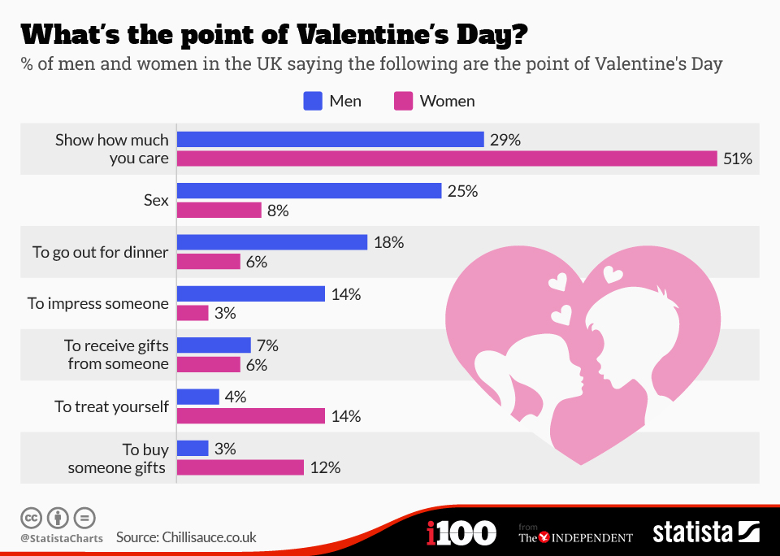

# 2021/W7: ​What's the point of Valentine's Day?

**Data (data.world):** [https://data.world/makeovermonday/2021w7](https://data.world/makeovermonday/2021w7)

**Article / original viz:** [https://www.statista.com/chart/amp/3229/whats-the-point-of-valentines-day/](https://www.statista.com/chart/amp/3229/whats-the-point-of-valentines-day/)

**Dataset:** `makeovermonday/2021w7`  
**Last updated on data.world:** 2021-02-14T11:20:16.631Z

---

Men are highly likely to consider sex and eating out as the main point of Valentine's Day

---
{"editor":"markdown"}
---
# **Original Visualization**

​

# **About this Dataset**
SOURCE ARTICLE: [Statista](https://www.statista.com/chart/3229/whats-the-point-of-valentines-day/)
DATA SOURCE: [Statista](https://www.statista.com/chart/3229/whats-the-point-of-valentines-day/)

​

# **Objectives**

* What works and what could be improved with this chart?
* How can you make it better?