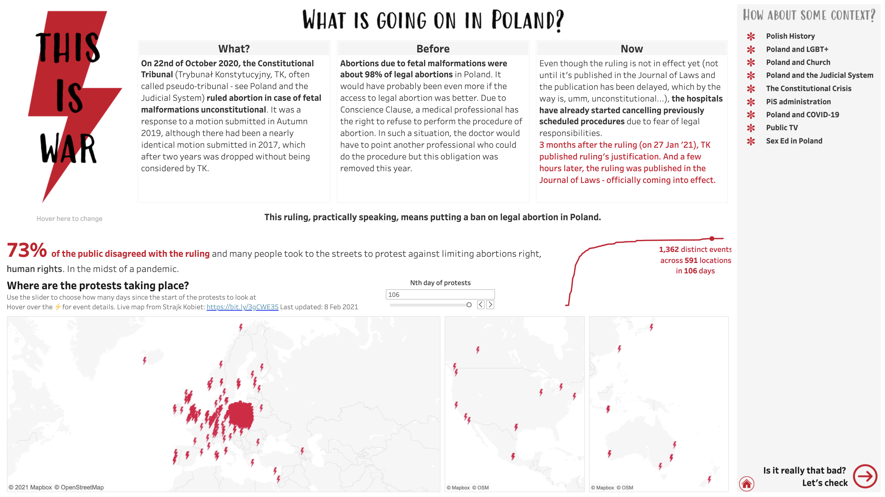

# 2021/W8: Protests Against Limiting Abortion Rights in Poland

**Data (data.world):** [https://data.world/makeovermonday/2021w8](https://data.world/makeovermonday/2021w8)

**Article / original viz:** [https://public.tableau.com/profile/hanna.nykowska#!/vizhome/ThisisWar-AbortioninPoland/whatisgoingoninpoland](https://public.tableau.com/profile/hanna.nykowska#!/vizhome/ThisisWar-AbortioninPoland/whatisgoingoninpoland)

**Dataset:** `makeovermonday/2021w8`  
**Last updated on data.world:** 2021-02-21T18:44:24.897Z

---

Where and when are pro-choice protests taking place in Poland?

---
{"editor":"simple"}
---
On 22nd of October 2020, in the middle of a pandemic, the Constitutional Tribunal of Poland ruled abortion in case of fetal malformations unconstitutional. When and where were the protests that followed?

## **Original Viz**

​

## **About This Dataset**
SOURCE: [Hania Nykowska via Tableau Public](https://public.tableau.com/profile/hanna.nykowska#!/vizhome/ThisisWar-AbortioninPoland/whatisgoingoninpoland)
DATA SOURCE: Ogólnopolski Strajk Kobiet | [@strajkkobiet](https://twitter.com/strajkkobiet) • Prepared by Hania Nykowska | [@hanykowska](https://twitter.com/hanykowska)