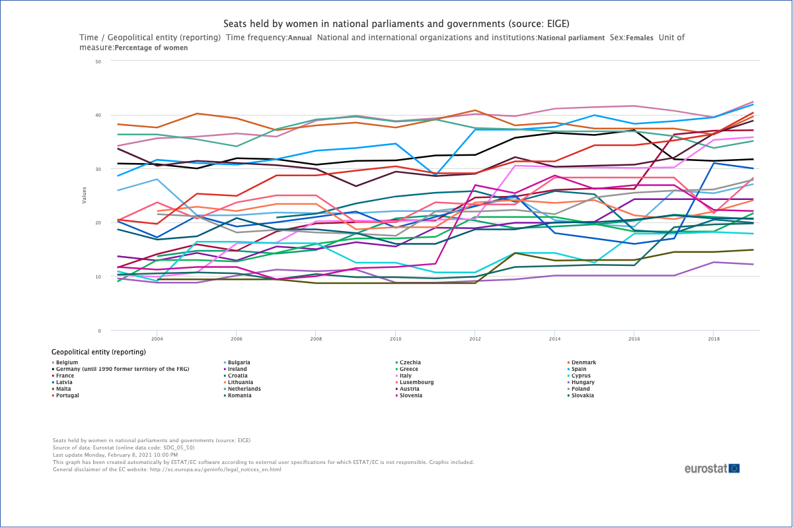

# 2021/W9: Seats Held by Women in National Parliaments

**Data (data.world):** [https://data.world/makeovermonday/2021w9](https://data.world/makeovermonday/2021w9)

**Article / original viz:** [https://ec.europa.eu/eurostat/databrowser/view/sdg_05_50/default/table?lang=en](https://ec.europa.eu/eurostat/databrowser/view/sdg_05_50/default/table?lang=en)

**Dataset:** `makeovermonday/2021w9`  
**Last updated on data.world:** 2021-02-28T11:37:31.839Z

---

Seats Held by Women in National Parliaments and Governments

---
{"editor":"simple"}
---
## **Original Visualization**

​

## **About This Dataset**
**From Eurostat:**

_The indicator measures the proportion of women in national parliaments and national governments. The national parliament is the national legislative assembly and the indicator refers to both chambers (lower house and an upper house, where relevant)._

_The count of members of a parliament includes the president/speaker/leader of the parliament. The national government is the executive body with authority to govern a country or a state._

_Members of government include both senior ministers (having a seat in the cabinet or council of ministers, including the prime minister) and junior ministers (not having a seat in the cabinet). In some countries state-secretaries (or the national equivalent) are considered as junior ministers within the government (with no seat in the cabinet), but in other countries they are not considered as members of the government._

SOURCE: [Eurostat](https://ec.europa.eu/eurostat/web/products-datasets/-/sdg_05_50)
DATA SOURCE: [Eurostat](https://ec.europa.eu/eurostat/web/products-datasets/-/sdg_05_50)