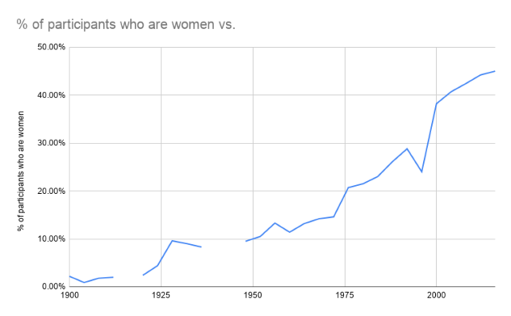

# 2021/W10: IOC Hits New Record with 47.7% Women

**Data (data.world):** [https://data.world/makeovermonday/2021w10](https://data.world/makeovermonday/2021w10)

**Article / original viz:** [https://swimswam.com/ioc-hits-new-record-with-47-7-women/](https://swimswam.com/ioc-hits-new-record-with-47-7-women/)

**Dataset:** `makeovermonday/2021w10`  
**Last updated on data.world:** 2021-03-07T17:27:17.248Z

---

International Women's Day: IOC Hits New Record with 47.7% Women

---
{"editor":"simple"}
---
## **Original Visualization**

​

## **About This Dataset**
SOURCE: [International Women's Day: ](https://swimswam.com/ioc-hits-new-record-with-47-7-women/)[IOC Hits New Record with 47.7% Women](https://swimswam.com/ioc-hits-new-record-with-47-7-women/)
DATA SOURCE: [International Olympic Committee](https://stillmedab.olympic.org/media/Document%20Library/OlympicOrg/Factsheets-Reference-Documents/Women-in-the-Olympic-Movement/Factsheet-Women-in-the-Olympic-Movement.pdf#_ga=2.150741558.1281153798.1612817630-235483746.1612817630)