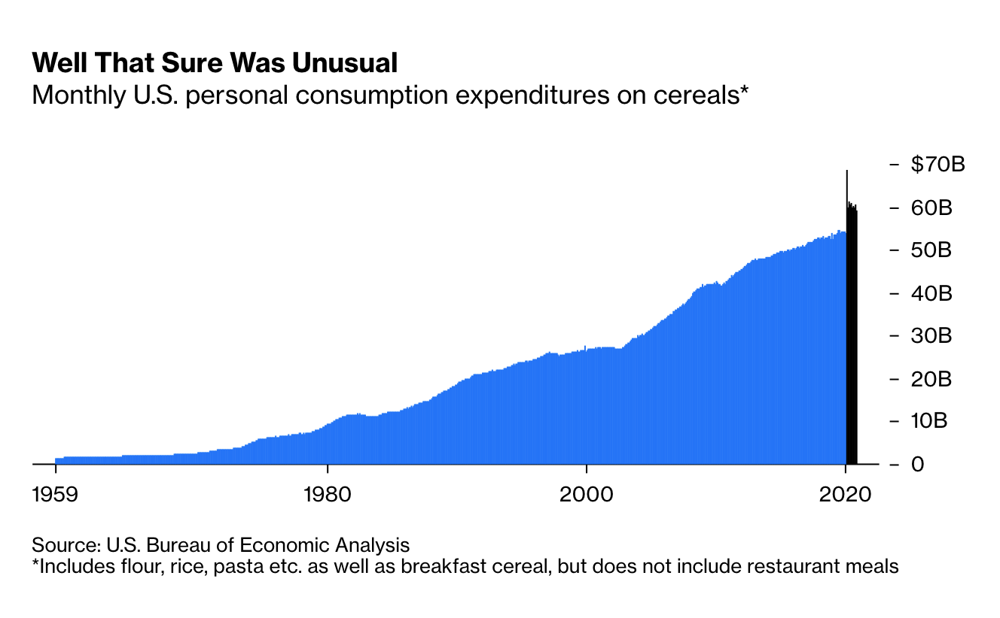

# 2021/W12: The Cereal Industry Had a Very Weird Year

**Data (data.world):** [https://data.world/makeovermonday/2021w12](https://data.world/makeovermonday/2021w12)

**Article / original viz:** [https://www.bloomberg.com/opinion/articles/2021-02-24/beyond-grape-nuts-cereal-makers-had-a-very-weird-year](https://www.bloomberg.com/opinion/articles/2021-02-24/beyond-grape-nuts-cereal-makers-had-a-very-weird-year)

**Dataset:** `makeovermonday/2021w12`  
**Last updated on data.world:** 2021-03-21T20:32:49.803Z

---

Personal Consumption Expenditures by Type of Product

---
{"editor":"simple"}
---
# **Original Visualization**

​

# **About this Dataset**
SOURCE ARTICLE: [Bloomberg](https://www.bloomberg.com/opinion/articles/2021-02-24/beyond-grape-nuts-cereal-makers-had-a-very-weird-year)

DATA SOURCE: [Bureau of Economic Analysis](https://apps.bea.gov/iTable/iTable.cfm?ReqID=19&step=2#reqid=19&step=2&isuri=1&1921=underlying)

NOTES:

1. Personal Consumption Expenditures on Food and beverages purchased for off-premises consumption
2. Millions of dollars; quarters and months are seasonally adjusted at annual rates])

# **Objectives**

* What works and what could be improved with this chart?
* How can you make it better?