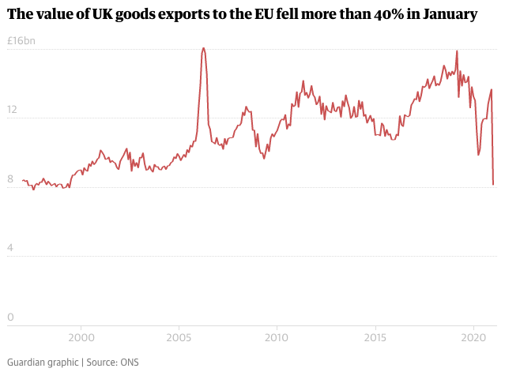

# 2021/W13: UK Exports to EU have plunged since Brexit

**Data (data.world):** [https://data.world/makeovermonday/2021w13](https://data.world/makeovermonday/2021w13)

**Article / original viz:** [https://www.theguardian.com/business/2021/mar/12/exports-to-eu-plunge-in-first-month-since-brexit-uk-economy](https://www.theguardian.com/business/2021/mar/12/exports-to-eu-plunge-in-first-month-since-brexit-uk-economy)

**Dataset:** `makeovermonday/2021w13`  
**Last updated on data.world:** 2021-03-31T14:46:04.778Z

---

Exports to EU plunge by 40% in first month since Brexit

---
{"editor":"markdown"}
---
# **Original Visualization**

​

# **About this Dataset**
SOURCE ARTICLE: [The Guardian](https://www.theguardian.com/business/2021/mar/12/exports-to-eu-plunge-in-first-month-since-brexit-uk-economy)

DATA SOURCE: [ONS - UK trade goods and services publication table 14](https://www.ons.gov.uk/economy/nationalaccounts/balanceofpayments/datasets/uktradegoodsandservicespublicationtables) (expressed as £ million)

​

# **Objectives**

* What works and what could be improved with this chart?
* How can you make it better?