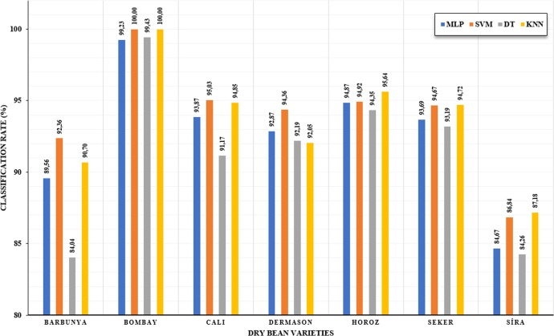

# 2021/W14: Multiclass Classification of Dry Beans

**Data (data.world):** [https://data.world/makeovermonday/2021w14](https://data.world/makeovermonday/2021w14)

**Article / original viz:** [https://www.sciencedirect.com/science/article/abs/pii/S0168169919311573](https://www.sciencedirect.com/science/article/abs/pii/S0168169919311573)

**Dataset:** `makeovermonday/2021w14`  
**Last updated on data.world:** 2021-04-04T10:38:27.967Z

---

---
{"editor":"simple"}
---
### **REQUIRED CITATION:**
KOKLU, M. and OZKAN, I.A., (2020), “Multiclass Classification of Dry Beans Using Computer Vision and Machine Learning Techniques.” Computers and Electronics in Agriculture, 174, 105507.

DOI: https://doi.org/10.1016/j.compag.2020.105507

​

# **Original Visualization**

​

# **About this Dataset**
SOURCE ARTICLA: [Multiclass Classification of Dry Beans](https://www.sciencedirect.com/science/article/abs/pii/S0168169919311573)
DATA SOURCE: [UCI Machine Learning Repository](https://archive.ics.uci.edu/ml/datasets/Dry+Bean+Dataset)

​

# **Objectives**

* What works and what could be improved with this chart?
* How can you make it better?