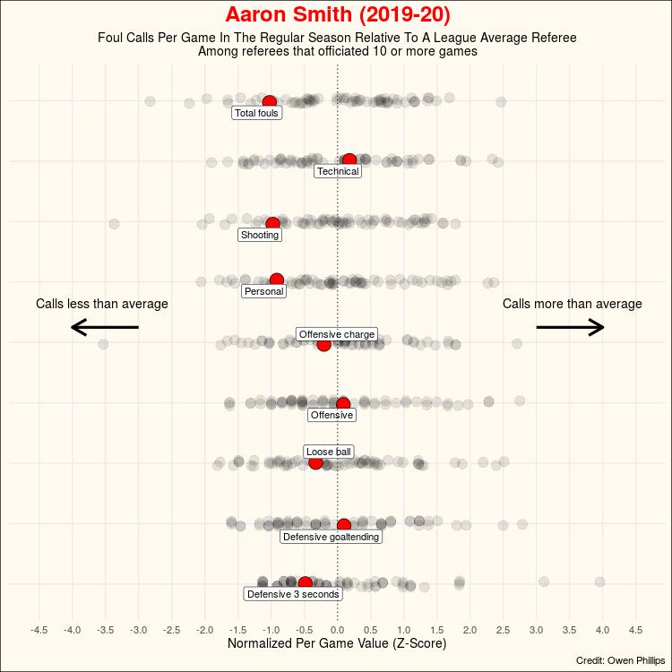

# 2021/W15: Fouls Called By NBA Referees

**Data (data.world):** [https://data.world/makeovermonday/2021w15](https://data.world/makeovermonday/2021w15)

**Article / original viz:** [https://twitter.com/owenlhjphillips/status/1336681714366689280](https://twitter.com/owenlhjphillips/status/1336681714366689280)

**Dataset:** `makeovermonday/2021w15`  
**Last updated on data.world:** 2021-04-11T13:42:21.275Z

---

Fouls Called By NBA Referees

---
{"editor":"simple"}
---
# **Original Visualization**

​

# About This Dataset
Original Visualization: [Twitter](https://twitter.com/owenlhjphillips/status/1336681714366689280)
Data Source: [The Unofficial NBA Ref Ball Database](https://llewellynjean.shinyapps.io/NBARefDatabase/)
Credit: [@owenphillips](https://twitter.com/owenlhjphillips)

​

# **Objectives**

* What works and what could be improved with this chart?
* How can you make it better?