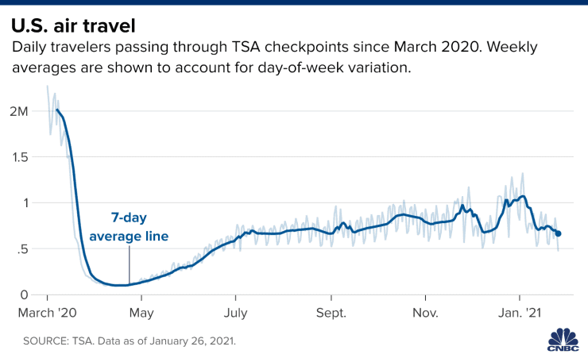

# 2021/W16: Monthly Air Passengers in America

**Data (data.world):** [https://data.world/makeovermonday/2021w16](https://data.world/makeovermonday/2021w16)

**Article / original viz:** [https://www.cnbc.com/2021/01/27/us-air-travel-falls-to-lowest-since-july-as-covid-infections-travel-restrictions-hinder-recovery.html](https://www.cnbc.com/2021/01/27/us-air-travel-falls-to-lowest-since-july-as-covid-infections-travel-restrictions-hinder-recovery.html)

**Dataset:** `makeovermonday/2021w16`  
**Last updated on data.world:** 2021-04-18T14:41:39.173Z

---

Monthly Air Passengers in America - 2000-2020

---
{"editor":"simple"}
---
# **Original Visualization**

​

# About This Dataset
Original Visualization: [US Air Travel Falls Due to Covid Epidemic](https://www.cnbc.com/2021/01/27/us-air-travel-falls-to-lowest-since-july-as-covid-infections-travel-restrictions-hinder-recovery.html)
Data Source: [Bureau of Transportation Statistics](https://www.transtats.bts.gov/DL_SelectFields.asp?gnoyr_VQ=FMF)

​

# **Objectives**

* What works and what could be improved with this chart?
* How can you make it better?