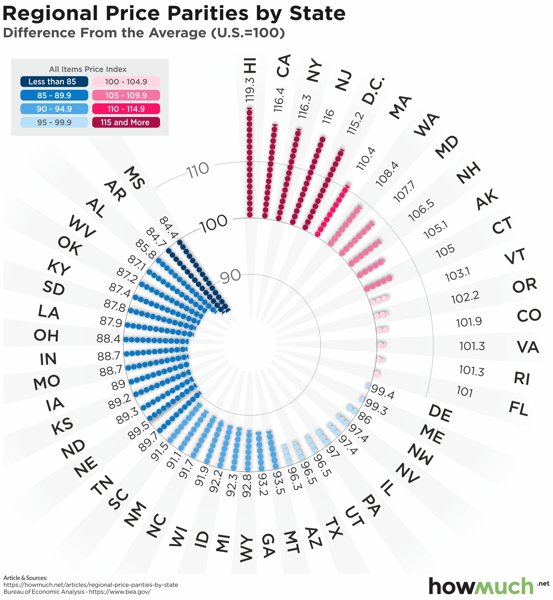

# 2021/W17: Regional Price Parity Per State

**Data (data.world):** [https://data.world/makeovermonday/2021w17](https://data.world/makeovermonday/2021w17)

**Article / original viz:** [https://howmuch.net/articles/regional-price-parities-by-state](https://howmuch.net/articles/regional-price-parities-by-state)

**Dataset:** `makeovermonday/2021w17`  
**Last updated on data.world:** 2021-04-25T10:17:50.800Z

---

How do regional prices in America compare from 2008-2019

---
{"editor":"simple"}
---

​

# **About this Dataset**
SOURCE ARTICLE: [howmuch.net](https://howmuch.net/articles/regional-price-parities-by-state)
DATA SOURCE: [U.S. Bureau of Economic Analysis](https://apps.bea.gov/iTable/iTable.cfm?reqid=70&step=1&acrdn=8)

​

# **Objectives**

* What works and what could be improved with this chart?
* How can you make it better?