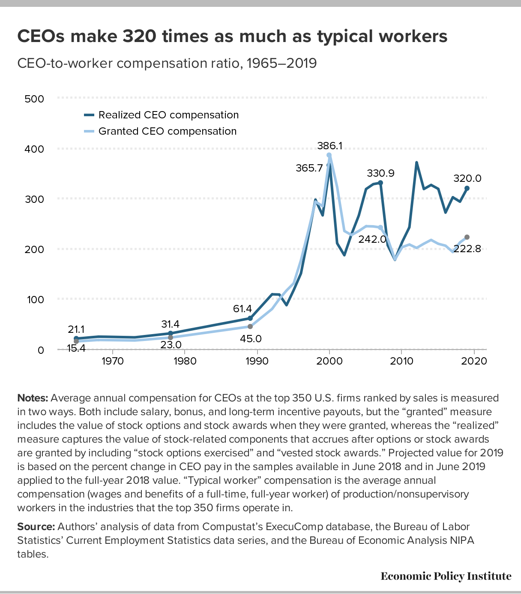

# 2021/W18: CEO-to-Worker Compensation Ratio

**Data (data.world):** [https://data.world/makeovermonday/2021w18](https://data.world/makeovermonday/2021w18)

**Article / original viz:** [https://www.epi.org/publication/ceo-compensation-surged-14-in-2019-to-21-3-million-ceos-now-earn-320-times-as-much-as-a-typical-worker/](https://www.epi.org/publication/ceo-compensation-surged-14-in-2019-to-21-3-million-ceos-now-earn-320-times-as-much-as-a-typical-worker/)

**Dataset:** `makeovermonday/2021w18`  
**Last updated on data.world:** 2021-05-02T08:56:25.538Z

---

CEOs make 320 times as much as typical workers at the top 350 U.S. firms ranked by sales

---
{"editor":"simple"}
---
# **Original Visualization**

​

# **About this Dataset**
SOURCE ARTICLE: [Economic Policy Institute](https://www.epi.org/publication/ceo-compensation-surged-14-in-2019-to-21-3-million-ceos-now-earn-320-times-as-much-as-a-typical-worker/)
DATA SOURCE: [Economic Policy Institute | Figure B](https://www.epi.org/publication/ceo-compensation-surged-14-in-2019-to-21-3-million-ceos-now-earn-320-times-as-much-as-a-typical-worker/)

​

# **Objectives**

* What works and what could be improved with this chart?
* How can you make it better?