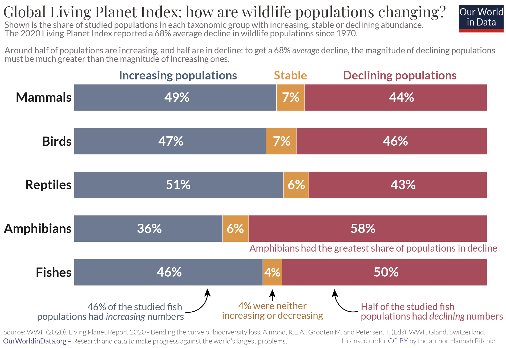

# 2021/W21: How are wildlife populations changing?

**Data (data.world):** [https://data.world/makeovermonday/2021w21](https://data.world/makeovermonday/2021w21)

**Article / original viz:** [https://ourworldindata.org/living-planet-index-understanding](https://ourworldindata.org/living-planet-index-understanding)

**Dataset:** `makeovermonday/2021w21`  
**Last updated on data.world:** 2021-05-23T13:26:35.193Z

---

How are wildlife populations changing?

---
{"editor":"simple"}
---
# **Original Visualization**

# **About this Dataset**
SOURCE ARTICLE: [Our World in Data](https://ourworldindata.org/living-planet-index-understanding)
DATA SOURCE: [Our World in Data](https://ourworldindata.org/living-planet-index-understanding)
CITATION: WWF (2020) Living Planet Report 2020 - Bending the curve of biodiversity loss. Almond, R.E.A., Grooten M. and Petersen, T. (Eds). WWF, Gland, Switzerland

​