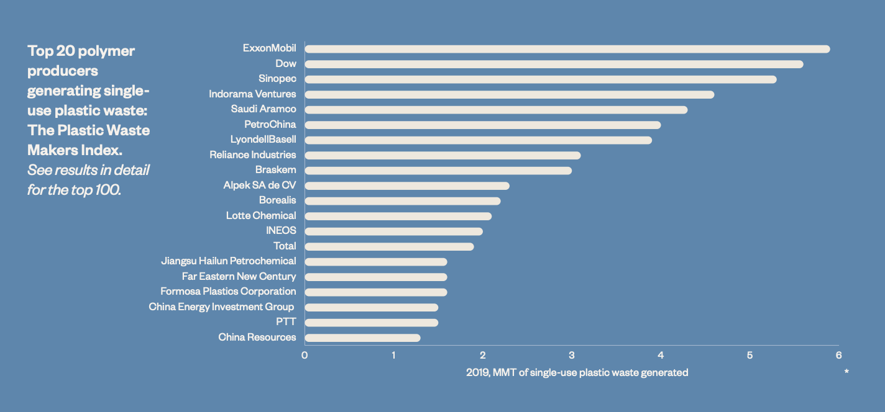

# 2021/W22: The Plastic Waste Makers Index

**Data (data.world):** [https://data.world/makeovermonday/2021w22](https://data.world/makeovermonday/2021w22)

**Article / original viz:** [https://cdn.minderoo.org/content/uploads/2021/05/18065501/20210518-Plastic-Waste-Makers-Index.pdf](https://cdn.minderoo.org/content/uploads/2021/05/18065501/20210518-Plastic-Waste-Makers-Index.pdf)

**Dataset:** `makeovermonday/2021w22`  
**Last updated on data.world:** 2021-05-30T14:42:26.823Z

---

Which companies produce the most plastic waste?

---
{"editor":"simple"}
---
# Original Visualization

​

# Resources
Original Article: [The Plastic Waste Makers Index](https://cdn.minderoo.org/content/uploads/2021/05/18065501/20210518-Plastic-Waste-Makers-Index.pdf)
Data Source: [Minderoo](https://www.minderoo.org/plastic-waste-makers-index/data/indices/producers/)