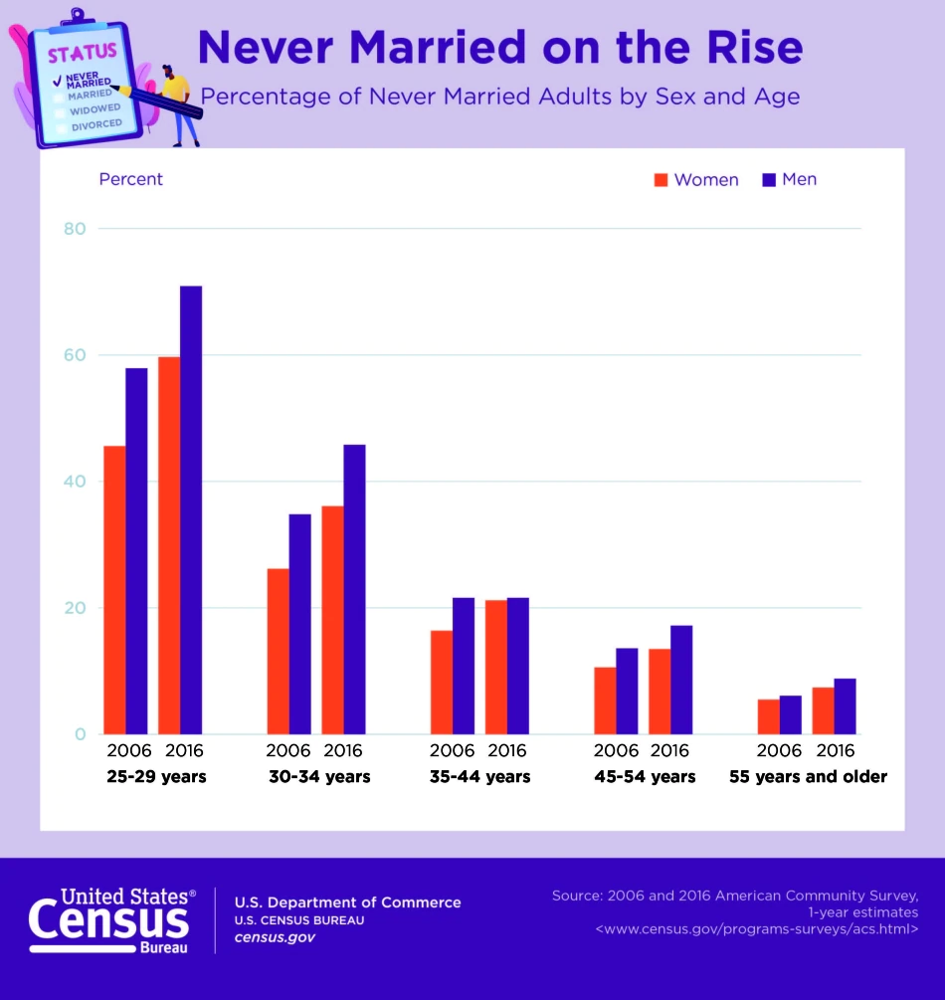

# 2021/W23: Never Married Is on the Rise

**Data (data.world):** [https://data.world/makeovermonday/2021w23](https://data.world/makeovermonday/2021w23)

**Article / original viz:** [https://www.census.gov/newsroom/press-releases/2021/marriages-and-divorces.html](https://www.census.gov/newsroom/press-releases/2021/marriages-and-divorces.html)

**Dataset:** `makeovermonday/2021w23`  
**Last updated on data.world:** 2021-06-06T09:01:59.291Z

---

Percentage of Never Married Adults by Sex and Age

---
{"editor":"simple"}
---
# Original Visualization

​

# Resources
Original Article: [Number, Timing and Duration of Marriages and Divorces](https://www.census.gov/newsroom/press-releases/2021/marriages-and-divorces.html)
Data Source: [U.S. Census](https://www.census.gov/content/dam/Census/library/publications/2021/demo/p70-167.pdf)