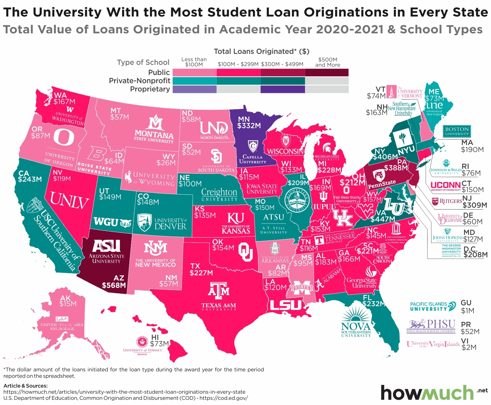

# 2021/W24: Which Schools Create the Most Student Loans?

**Data (data.world):** [https://data.world/makeovermonday/2021w24](https://data.world/makeovermonday/2021w24)

**Article / original viz:** [https://howmuch.net/articles/university-with-the-most-student-loan-originations-in-every-state](https://howmuch.net/articles/university-with-the-most-student-loan-originations-in-every-state)

**Dataset:** `makeovermonday/2021w24`  
**Last updated on data.world:** 2021-06-13T06:48:51.079Z

---

Which Schools Create the Most Student Loans in the U.S.?

---
{"editor":"simple"}
---
# Original Visualization

​

# Resources
Original Article: [howmuch.net](https://howmuch.net/articles/university-with-the-most-student-loan-originations-in-every-state)
Data Source: Common Origination and Disbursement (COD) System via [howmuch.net](https://howmuch.net/sources/university-with-the-most-student-loan-originations-in-every-state)