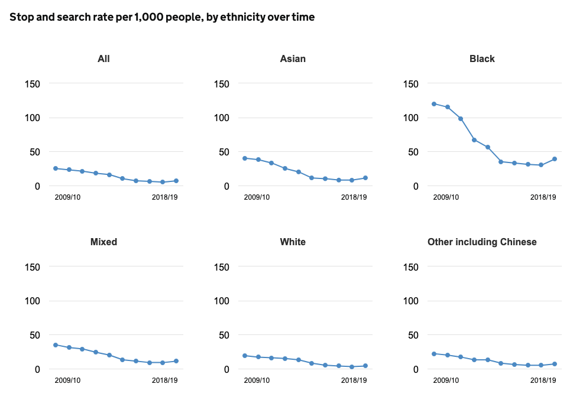

# 2021/W25: Stop & Search by Ethnicity in England & Wales

**Data (data.world):** [https://data.world/makeovermonday/2021w25](https://data.world/makeovermonday/2021w25)

**Article / original viz:** [https://www.ethnicity-facts-figures.service.gov.uk/crime-justice-and-the-law/policing/stop-and-search/latest#by-ethnicity-over-time](https://www.ethnicity-facts-figures.service.gov.uk/crime-justice-and-the-law/policing/stop-and-search/latest#by-ethnicity-over-time)

**Dataset:** `makeovermonday/2021w25`  
**Last updated on data.world:** 2021-06-20T07:39:51.060Z

---

Stop & Search Rates by Ethnicity in England & Wales

---
{"editor":"simple"}
---
# Original Visualization

​

# Resources
Original Visualization: [Stop & Search - gov.uk](https://www.ethnicity-facts-figures.service.gov.uk/crime-justice-and-the-law/policing/stop-and-search/latest#by-ethnicity-over-time)
Data Source: [gov.uk](https://www.ethnicity-facts-figures.service.gov.uk/crime-justice-and-the-law/policing/stop-and-search/latest#download-the-data)