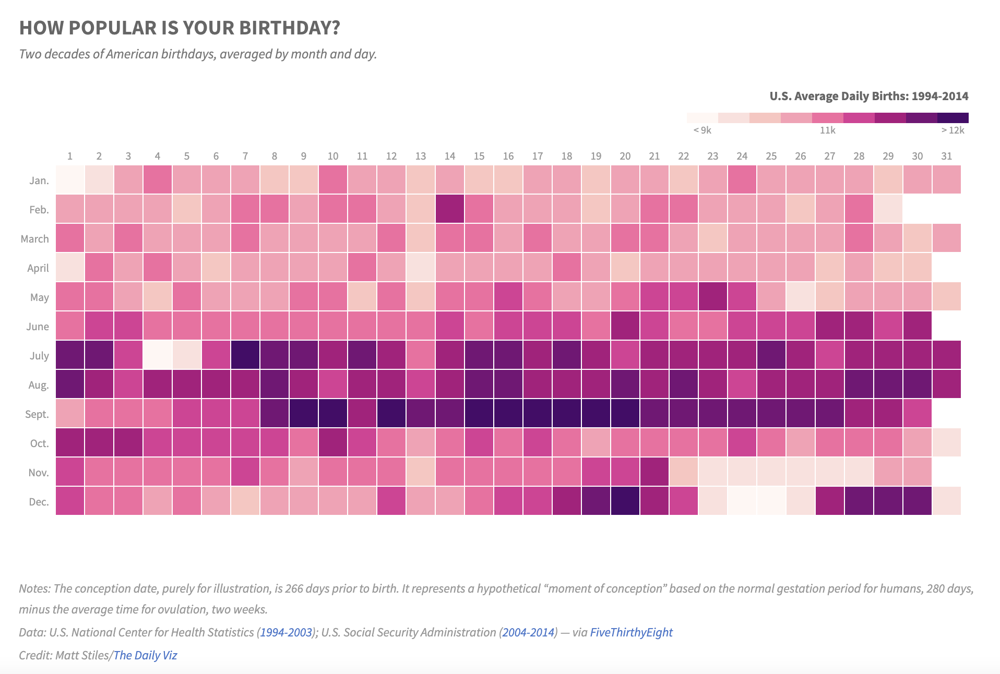

# 2021/W26: How Popular Is Your Birthday?

**Data (data.world):** [https://data.world/makeovermonday/2021w26](https://data.world/makeovermonday/2021w26)

**Article / original viz:** [http://thedailyviz.com/2016/09/17/how-common-is-your-birthday-dailyviz/](http://thedailyviz.com/2016/09/17/how-common-is-your-birthday-dailyviz/)

**Dataset:** `makeovermonday/2021w26`  
**Last updated on data.world:** 2021-06-30T10:42:49.948Z

---

How popular is your birthday?

---
{"editor":"simple"}
---
# Original Visualization

​

# Resources
Original Article: [How Common is Your Birthday?](http://thedailyviz.com/2016/09/17/how-common-is-your-birthday-dailyviz/)
Data Source: U.S. National Center for Health Statistics ([1994-2003](https://github.com/fivethirtyeight/data/blob/master/births/US_births_1994-2003_CDC_NCHS.csv)); U.S. Social Security Administration ([2004-2014](https://github.com/fivethirtyeight/data/blob/master/births/US_births_2000-2014_SSA.csv)) — via [FiveThirthyEight](https://github.com/fivethirtyeight/data/births)