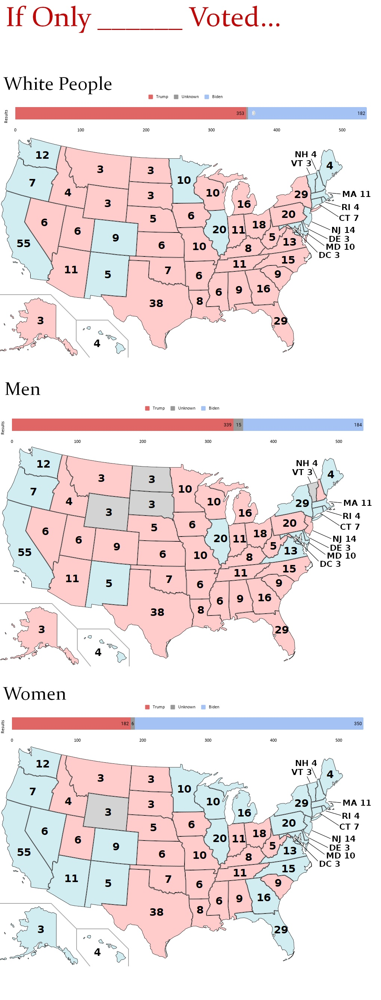

# 2021/W27: If Only ____ Voted

**Data (data.world):** [https://data.world/makeovermonday/2021w27](https://data.world/makeovermonday/2021w27)

**Article / original viz:** [https://www.reddit.com/r/dataisbeautiful/comments/kji3wx/oc_2020_electoral_map_if_only_voted_breakdown_by/](https://www.reddit.com/r/dataisbeautiful/comments/kji3wx/oc_2020_electoral_map_if_only_voted_breakdown_by/)

**Dataset:** `makeovermonday/2021w27`  
**Last updated on data.world:** 2021-07-05T14:56:46.638Z

---

2020 Electoral Map -  If Only ____ Voted

---
{"editor":"simple"}
---
# Original Viz
NOTE: This is a cropped version of the original viz. View the original visualization [here](https://www.reddit.com/r/dataisbeautiful/comments/kji3wx/oc_2020_electoral_map_if_only_voted_breakdown_by/).

​

# Resources
Original Visualization: [2020 Electoral Map If Only \_\_\_\_ Voted](https://www.reddit.com/r/dataisbeautiful/comments/kji3wx/oc_2020_electoral_map_if_only_voted_breakdown_by/)
Created by: [Dustin Gibson](https://www.reddit.com/user/dustingibson/)
Data Source: [Dustin Gibson](https://docs.google.com/spreadsheets/d/1j-sTWtIrXuqMOj6I67X0Q9bpQ-XmKkf71jXj48j_BmE/edit#gid=244779571) via AP Votecast Exit Polls (which can be viewed on the [New York Times](https://www.nytimes.com/interactive/2020/11/03/us/elections/ap-polls-alaska.html))
Additional Info: [Reddit](https://www.reddit.com/r/dataisbeautiful/comments/kji3wx/oc_2020_electoral_map_if_only_voted_breakdown_by/ggwqnft/)