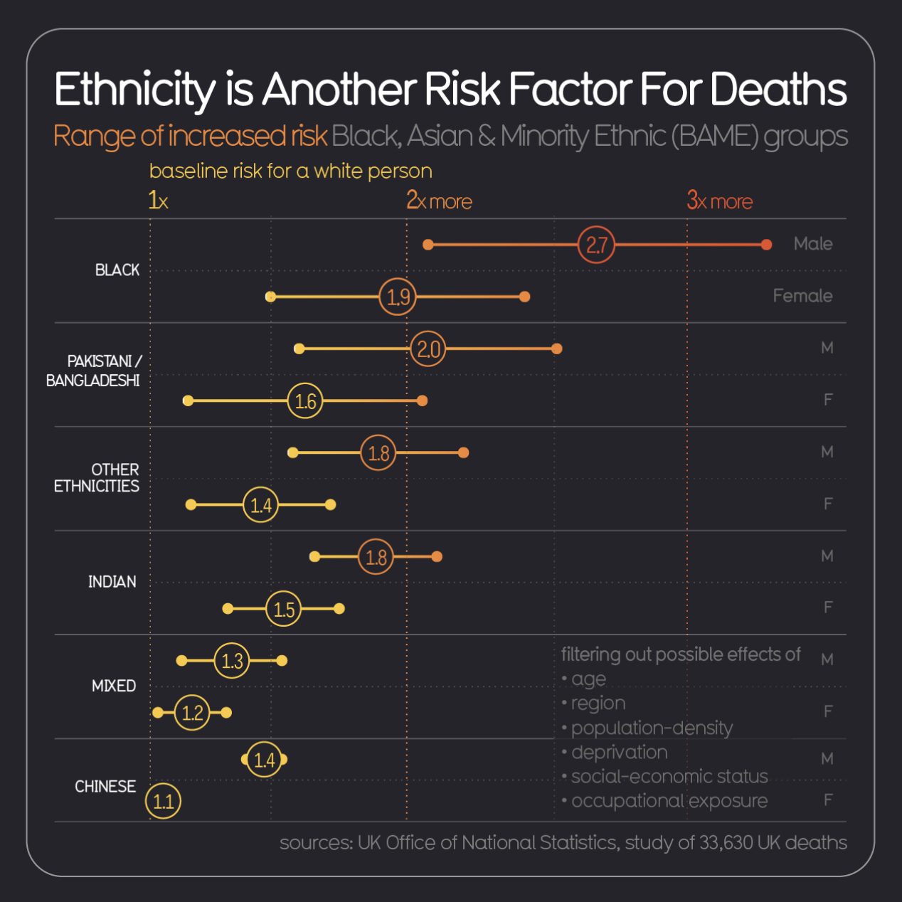

# 2021/W29: UK COVID-19 Mortality Rate by Ethnicity

**Data (data.world):** [https://data.world/makeovermonday/2021w29](https://data.world/makeovermonday/2021w29)

**Article / original viz:** [https://informationisbeautiful.net/visualizations/covid-19-coronavirus-infographic-datapack/](https://informationisbeautiful.net/visualizations/covid-19-coronavirus-infographic-datapack/)

**Dataset:** `makeovermonday/2021w29`  
**Last updated on data.world:** 2021-07-18T14:15:44.895Z

---

---
{"editor":"simple"}
---
# Original Visualization

​

# Resources
Original Viz: [Most minority ethnicities have a higher COVID-19 mortality rate](https://informationisbeautiful.net/visualizations/covid-19-coronavirus-infographic-datapack/)
Data Source: [Information is Beautiful](https://docs.google.com/spreadsheets/d/1g_YxmDfQx7aOU2DKzNZo9b-NTk62Bju6X3z6OuCa6gw/edit#gid=2004630296) via UK Office for National Statistics