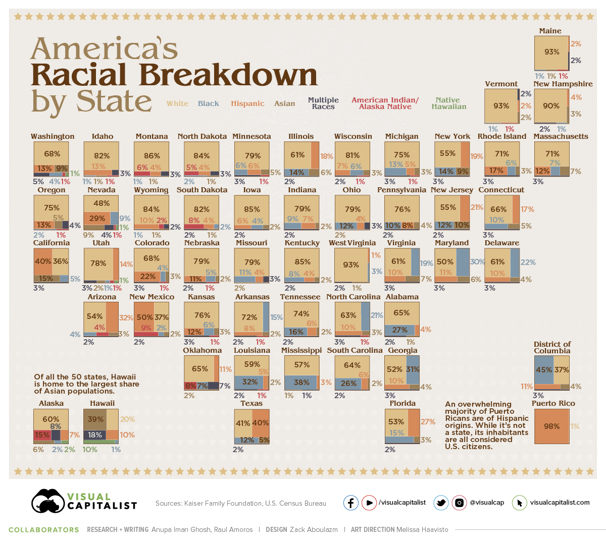

# 2021/W30: America's Racial Breakdown By State

**Data (data.world):** [https://data.world/makeovermonday/2021w30a](https://data.world/makeovermonday/2021w30a)

**Article / original viz:** [https://www.visualcapitalist.com/visualizing-u-s-population-by-race/](https://www.visualcapitalist.com/visualizing-u-s-population-by-race/)

**Dataset:** `makeovermonday/2021w30a`  
**Last updated on data.world:** 2021-07-25T06:34:47.201Z

---

America's Racial Breakdown By State

---
{"editor":"simple"}
---
# Original Visualization

​

# Resources
Original viz: [Visual Capitalist](https://www.visualcapitalist.com/visualizing-u-s-population-by-race/)

Data Source: Kaiser Family Foundation, U.S. Census Bureau