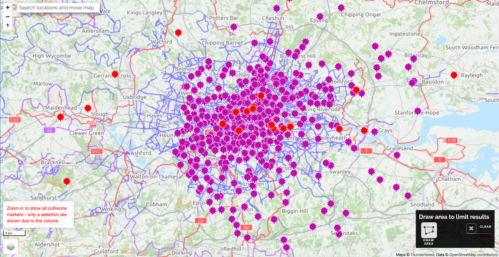

# 2021/W31: Bike Collisions in London (2005-2019)

**Data (data.world):** [https://data.world/makeovermonday/2021w31](https://data.world/makeovermonday/2021w31)

**Article / original viz:** [https://bikedata.cyclestreets.net/collisions/#9.44/51.4814/0.0567](https://bikedata.cyclestreets.net/collisions/#9.44/51.4814/0.0567)

**Dataset:** `makeovermonday/2021w31`  
**Last updated on data.world:** 2021-08-01T12:42:01.036Z

---

Bike Collisions in London (2005-2019)

---
{"editor":"simple"}
---
# Original Visualization

​

# Resources
[Bike Collisions in London](https://bikedata.cyclestreets.net/collisions/#9.44/51.4814/0.0567) (2005-2019)
Data Source: [CycleStreets](https://bikedata.cyclestreets.net/collisions/#9.44/51.4814/0.0567)