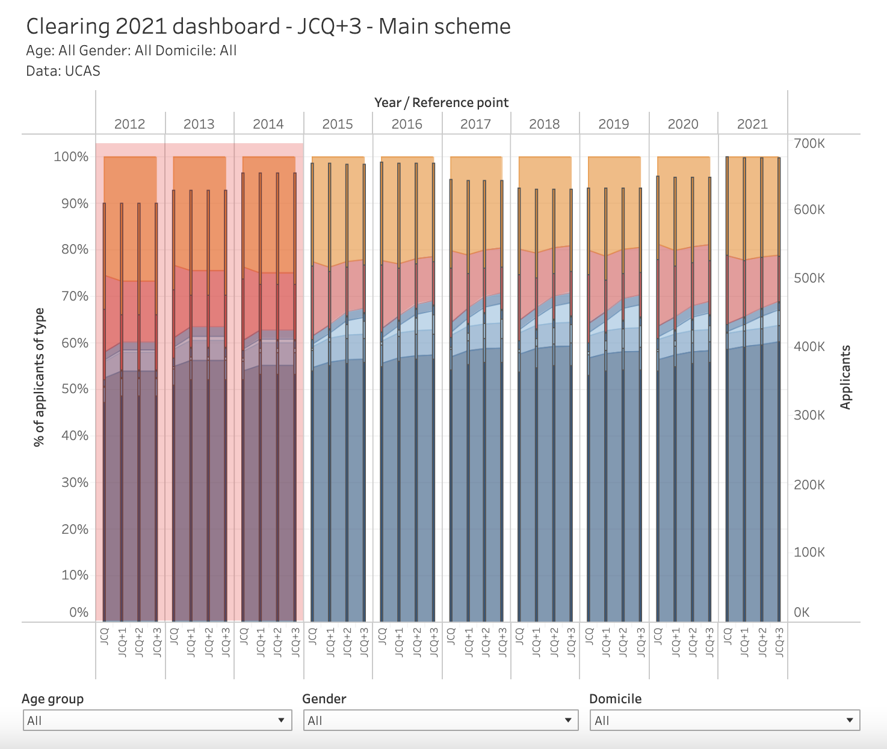

# 2021/W33: How's UCAS clearing going?

**Data (data.world):** [https://data.world/makeovermonday/2021w33](https://data.world/makeovermonday/2021w33)

**Article / original viz:** [https://wonkhe.com/wonk-corner/hows-clearing-going-then/](https://wonkhe.com/wonk-corner/hows-clearing-going-then/)

**Dataset:** `makeovermonday/2021w33`  
**Last updated on data.world:** 2021-08-19T14:00:39.727Z

---

Clearing is how unis and colleges fill any places they still have on their courses.

---
{"editor":"simple"}
---
# Original Visualization

​

# Resources
Original Article: [How's UCAS Clearing Going?](https://wonkhe.com/wonk-corner/hows-clearing-going-then/)
Data Source: [WONKHE](https://wonkhe.com/wonk-corner/hows-clearing-going-then/)
Author: [David Kernohan](https://twitter.com/dkernohan)