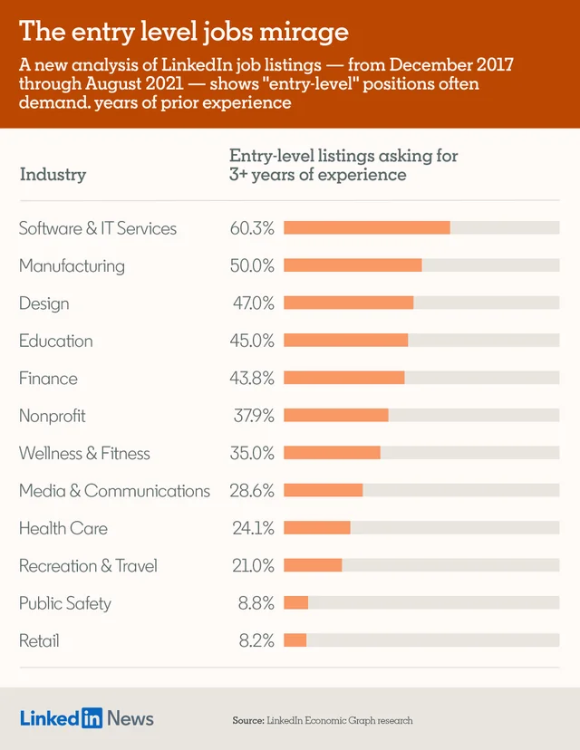

# 2021/W34: "Entry-level" jobs require 3+ years of experience

**Data (data.world):** [https://data.world/makeovermonday/2021w34](https://data.world/makeovermonday/2021w34)

**Article / original viz:** [https://www.linkedin.com/pulse/hirings-new-red-line-why-newcomers-cant-land-35-jobs-george-anders/](https://www.linkedin.com/pulse/hirings-new-red-line-why-newcomers-cant-land-35-jobs-george-anders/)

**Dataset:** `makeovermonday/2021w34`  
**Last updated on data.world:** 2021-08-22T08:02:57.024Z

---

---
{"editor":"simple"}
---
# Original Visualization

​

# Resources
Original Article: ["Entry-level" jobs on LinkedIn require 3+ years of experience](https://www.linkedin.com/pulse/hirings-new-red-line-why-newcomers-cant-land-35-jobs-george-anders/)
Data Source: [LinkedIn](https://www.linkedin.com/pulse/hirings-new-red-line-why-newcomers-cant-land-35-jobs-george-anders/)