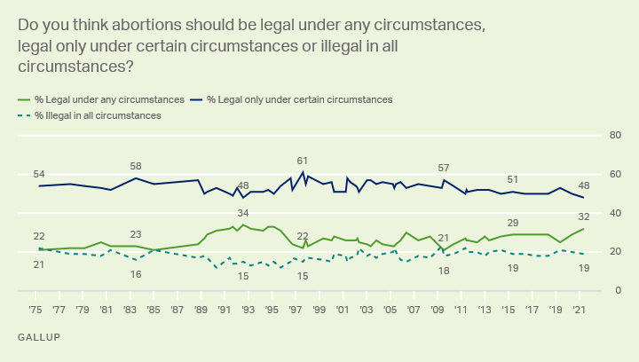

# 2021/W36: What do Americans think about abortion?

**Data (data.world):** [https://data.world/makeovermonday/2021w36](https://data.world/makeovermonday/2021w36)

**Article / original viz:** [https://fivethirtyeight.com/features/why-texass-abortion-law-may-go-too-far-for-most-americans/](https://fivethirtyeight.com/features/why-texass-abortion-law-may-go-too-far-for-most-americans/)

**Dataset:** `makeovermonday/2021w36`  
**Last updated on data.world:** 2021-09-05T10:50:42.212Z

---

Americans support abortion, but not in all cases

---
{"editor":"markdown"}
---
# Original Visualization

​
# **About this Dataset**
SOURCE ARTICLE: [FiveThirtyEight](https://fivethirtyeight.com/features/why-texass-abortion-law-may-go-too-far-for-most-americans/)
DATA SOURCE: [Gallup](https://news.gallup.com/poll/1576/abortion.aspx)