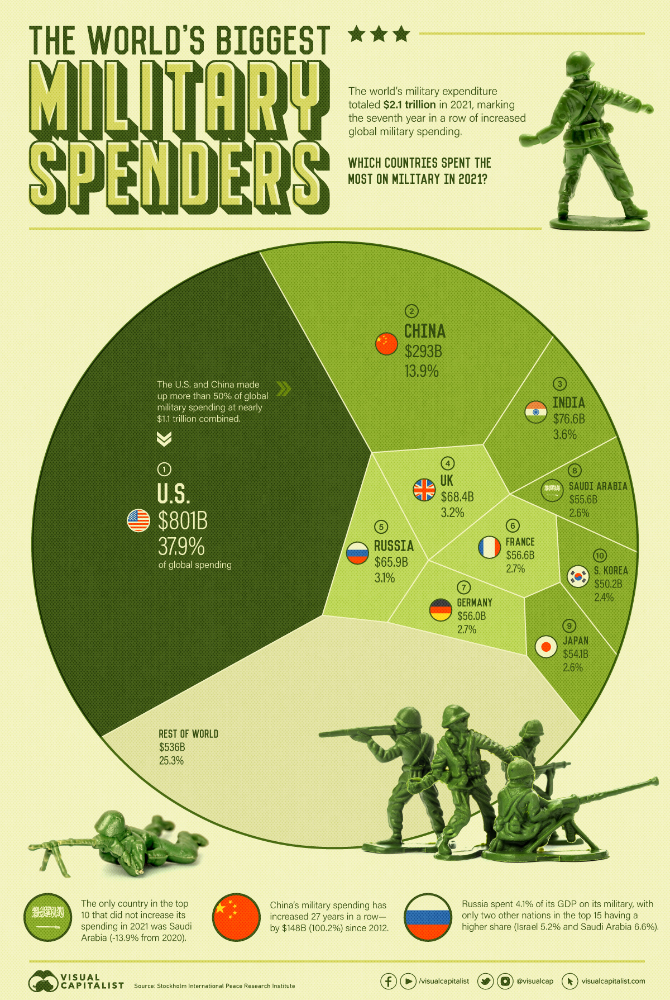

# 2022/W35: Top 10 Countries by Military Spending

**Data (data.world):** [https://data.world/makeovermonday/2022w35](https://data.world/makeovermonday/2022w35)

**Article / original viz:** [https://www.visualcapitalist.com/ranked-top-10-countries-by-military-spending](https://www.visualcapitalist.com/ranked-top-10-countries-by-military-spending)

**Original data source:** [https://milex.sipri.org/sipri](https://milex.sipri.org/sipri)

**Dataset:** `makeovermonday/2022w35`  
**Last updated on data.world:** 2022-08-29T07:44:11.558Z

---

Top 10 Countries by Military Spending

---
{"editor":"markdown"}
---
# Original Visualization
​

​

# Resources
Original Viz/Article - [Visual Capitalist](https://www.visualcapitalist.com/ranked-top-10-countries-by-military-spending/)
Data Source/Definitions - [SIPRI Military Expenditure Database](https://milex.sipri.org/sipri)