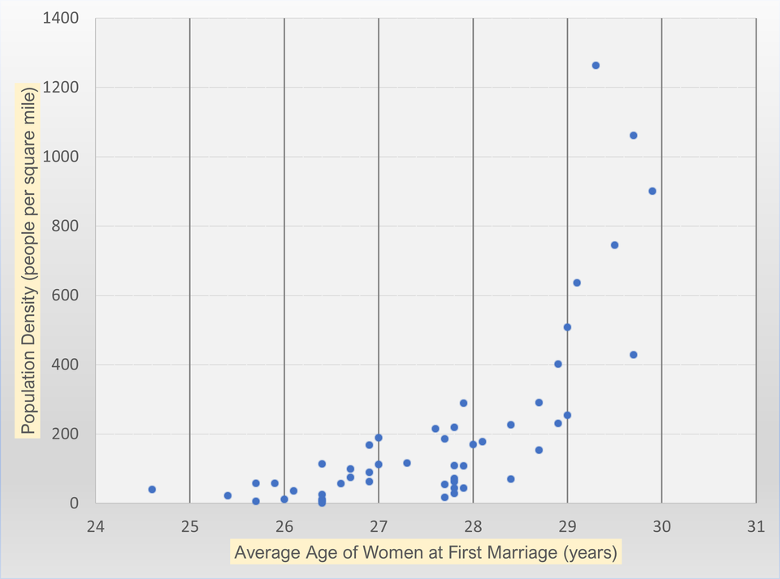

# 2022/W36: Median Age at First Marriage in America

**Data (data.world):** [https://data.world/makeovermonday/2022w36](https://data.world/makeovermonday/2022w36)

**Article / original viz:** [https://www.reddit.com/r/dataisbeautiful/comments/wzx70h/average_age_of_women_at_first_marriage_by_state](https://www.reddit.com/r/dataisbeautiful/comments/wzx70h/average_age_of_women_at_first_marriage_by_state)

**Original data source:** [https://www.prb.org/usdata/indicator/marriage-age-women/snapshot](https://www.prb.org/usdata/indicator/marriage-age-women/snapshot)

**Dataset:** `makeovermonday/2022w36`  
**Last updated on data.world:** 2022-09-05T07:24:06.808Z

---

Median Age of Women at First Marriage by State vs. State Population Density

---
{"editor":"simple"}
---
# Original Viz

# Resources
Original Viz/Article - [Reddit](https://www.reddit.com/r/dataisbeautiful/comments/wzx70h/average_age_of_women_at_first_marriage_by_state/)
Data Source - [PBR.org](https://www.prb.org/usdata/indicator/marriage-age-women/snapshot/)