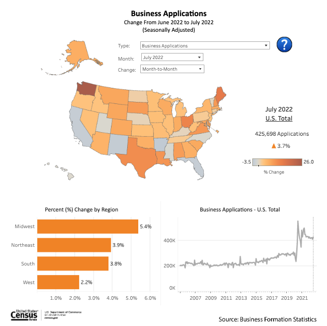

# 2022/W38: American Business Formations

**Data (data.world):** [https://data.world/makeovermonday/2022w38](https://data.world/makeovermonday/2022w38)

**Article / original viz:** [https://www.census.gov/econ/bfs/data.html](https://www.census.gov/econ/bfs/data.html)

**Original data source:** [https://www.census.gov/econ/bfs/data.html](https://www.census.gov/econ/bfs/data.html)

**Dataset:** `makeovermonday/2022w38`  
**Last updated on data.world:** 2022-09-19T05:52:19.968Z

---

---
{"editor":"simple"}
---
# Original Viz

​

# References
Article: [American Business Formations](https://www.census.gov/econ/bfs/data.html)
Data Source: [US Census Bureau | Business Formation Statistics](https://www.census.gov/econ/bfs/data.html)