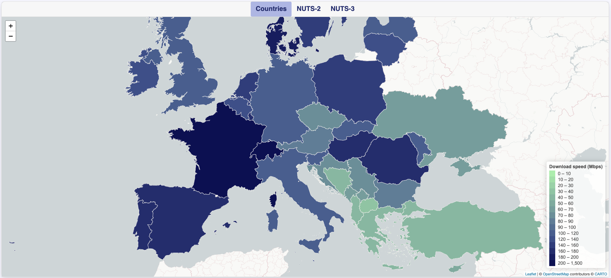

# 2022/W39: Average Internet Speeds Across Europe

**Data (data.world):** [https://data.world/makeovermonday/2022w39](https://data.world/makeovermonday/2022w39)

**Article / original viz:** [https://datavis.europeandatajournalism.eu/obct/connectivity](https://datavis.europeandatajournalism.eu/obct/connectivity)

**Original data source:** [https://registry.opendata.aws/speedtest-global-performance](https://registry.opendata.aws/speedtest-global-performance)

**Dataset:** `makeovermonday/2022w39`  
**Last updated on data.world:** 2022-09-25T10:23:07.102Z

---

---
{"editor":"simple"}
---
# Original Viz

​

# References
Article: [Average Internet Speeds Across Europe](https://datavis.europeandatajournalism.eu/obct/connectivity/)
Data Source: [Speedtest](https://www.speedtest.net/) by [Ookla](https://registry.opendata.aws/speedtest-global-performance/) Global Fixed and Mobile Network Performance Maps