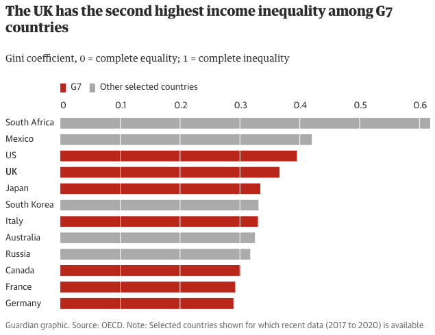

# 2022/W40: Income Inequality

**Data (data.world):** [https://data.world/makeovermonday/2022w40](https://data.world/makeovermonday/2022w40)

**Article / original viz:** [https://www.theguardian.com/politics/2022/sep/04/liz-truss-energy-prices-action-plan?CMP=Share_iOSApp_Other](https://www.theguardian.com/politics/2022/sep/04/liz-truss-energy-prices-action-plan?CMP=Share_iOSApp_Other)

**Original data source:** [https://data.oecd.org/inequality/income-inequality.htm](https://data.oecd.org/inequality/income-inequality.htm)

**Dataset:** `makeovermonday/2022w40`  
**Last updated on data.world:** 2022-10-03T07:24:48.195Z

---

Income inequality by country

---
{"editor":"simple"}
---
# Original Visualization

​

# Resources
Original Article: [Truss to push ahead with low-tax economy despite calls for caution](https://www.theguardian.com/politics/2022/sep/04/liz-truss-energy-prices-action-plan?CMP=Share_iOSApp_Other)
Data Source: [OECD](https://data.oecd.org/inequality/income-inequality.htm)