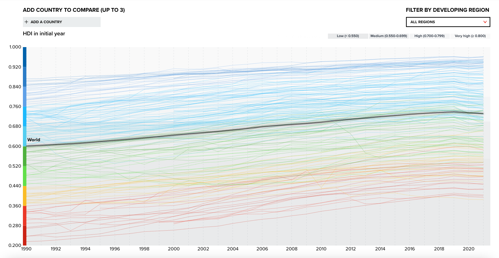

# 2022/W41: United Nations Human Development Index

**Data (data.world):** [https://data.world/makeovermonday/2022w41](https://data.world/makeovermonday/2022w41)

**Article / original viz:** [https://www.bbc.com/news/world-62824357.amp](https://www.bbc.com/news/world-62824357.amp)

**Original data source:** [https://hdr.undp.org/data-center/human-development-index#/indicies/HDI](https://hdr.undp.org/data-center/human-development-index#/indicies/HDI)

**Dataset:** `makeovermonday/2022w41`  
**Last updated on data.world:** 2022-10-10T07:59:16.177Z

---

United Nations Human Development Index

---
{"editor":"simple"}
---
# Original Visualization

​

# Resources
Article: [BBC News](https://www.bbc.com/news/world-62824357.amp)
Chart Source: [UNDP](https://hdr.undp.org/data-center/human-development-index#/indicies/HDI)
Data Source: [UNDP](https://hdr.undp.org/data-center/documentation-and-downloads)