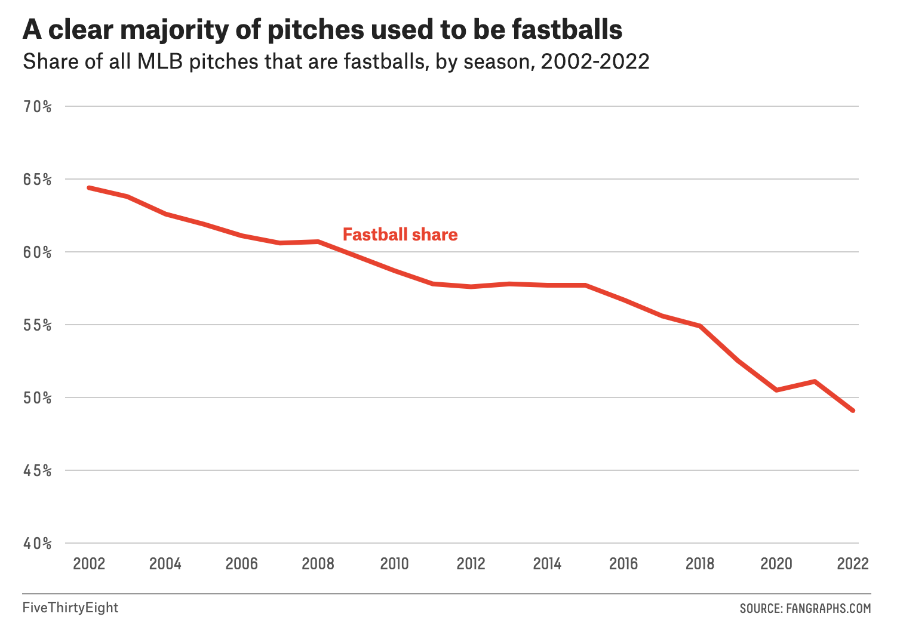

# 2022/W43: Major League Baseball Pitch Types

**Data (data.world):** [https://data.world/makeovermonday/2022w43](https://data.world/makeovermonday/2022w43)

**Article / original viz:** [https://fivethirtyeight.com/features/why-some-mlb-pitchers-are-abandoning-the-fastball](https://fivethirtyeight.com/features/why-some-mlb-pitchers-are-abandoning-the-fastball)

**Original data source:** [https://www.fangraphs.com/leaders.aspx?pos=all&stats=pit&lg=all&qual=0&type=c,13,31,75,77,79,81,83,85,87,89&season=2022&month=0&season1=2002&ind=0&team=0,ss&rost=0&age=0&filter=&players=0&startdate=&enddate=](https://www.fangraphs.com/leaders.aspx?pos=all&stats=pit&lg=all&qual=0&type=c,13,31,75,77,79,81,83,85,87,89&season=2022&month=0&season1=2002&ind=0&team=0,ss&rost=0&age=0&filter=&players=0&startdate=&enddate=)

**Dataset:** `makeovermonday/2022w43`  
**Last updated on data.world:** 2022-10-23T11:08:56.750559331Z

---

---
{"editor":"simple"}
---
## Original Visualization

​

## Resources
Article: [Why Some MLB Pitchers Are Abandoning The Fastball](https://fivethirtyeight.com/features/why-some-mlb-pitchers-are-abandoning-the-fastball/)
Source: [FiveThirtyEight](https://fivethirtyeight.com/features/why-some-mlb-pitchers-are-abandoning-the-fastball/)
Data Source: [FanGraphs](https://www.fangraphs.com/leaders.aspx?pos=all&stats=pit&lg=all&qual=0&type=c,13,31,75,77,79,81,83,85,87,89&season=2022&month=0&season1=2002&ind=0&team=0,ss&rost=0&age=0&filter=&players=0&startdate=&enddate=)
Glossary: [FanGraphs](https://library.fangraphs.com/pitching/complete-list-pitching/)