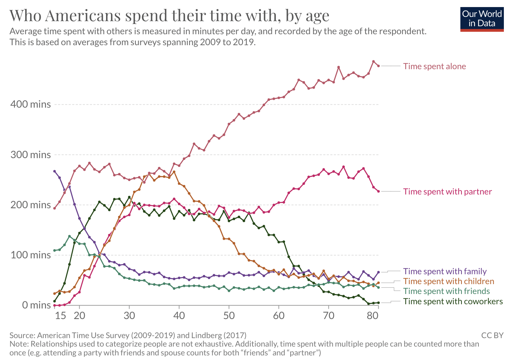

# 2022/W45: Who do we spend time with across our lifetime?

**Data (data.world):** [https://data.world/makeovermonday/2022w45](https://data.world/makeovermonday/2022w45)

**Article / original viz:** [https://ourworldindata.org/time-use#who-do-we-spend-time-with-across-our-lifetime](https://ourworldindata.org/time-use#who-do-we-spend-time-with-across-our-lifetime)

**Original data source:** [https://ourworldindata.org/time-use#who-do-we-spend-time-with-across-our-lifetime](https://ourworldindata.org/time-use#who-do-we-spend-time-with-across-our-lifetime)

**Dataset:** `makeovermonday/2022w45`  
**Last updated on data.world:** 2022-11-07T17:40:01.621167299Z

---

Who do we spend time with across our lifetime?

---
{"editor":"simple"}
---
## **Original Visualization**
​

​

## **References**
Original article - [https://ourworldindata.org/time-use#who-do-we-spend-time-with-across-our-lifetime](https://ourworldindata.org/time-use#who-do-we-spend-time-with-across-our-lifetime)

Data Source - [Our World in Data](https://ourworldindata.org/time-use#who-do-we-spend-time-with-across-our-lifetime)

Watch Me Viz - [https://youtu.be/XZliCbAyBX8](https://youtu.be/XZliCbAyBX8)